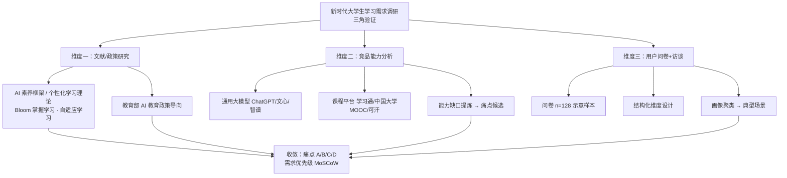
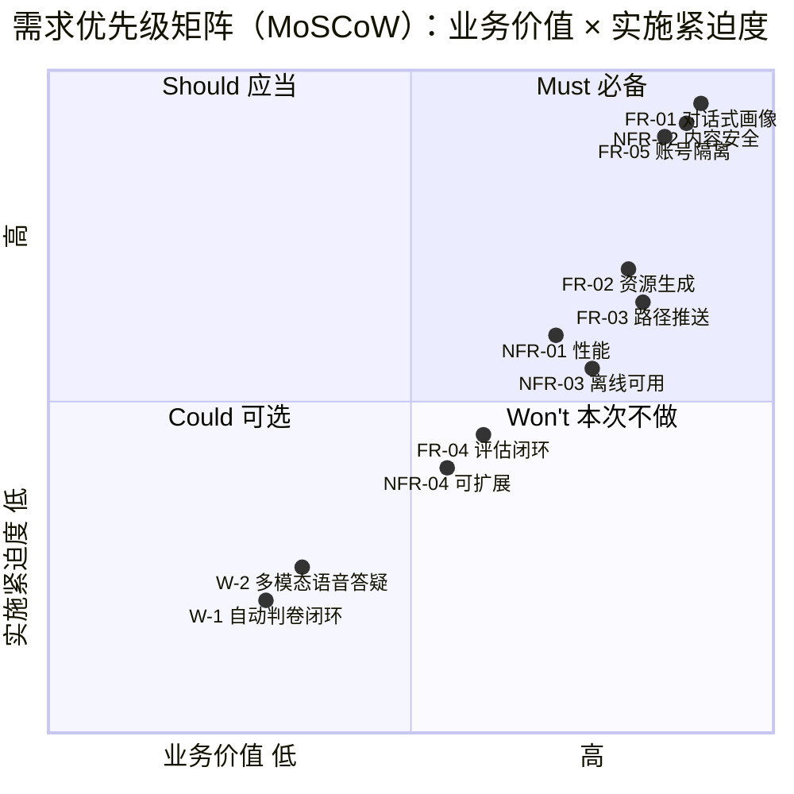
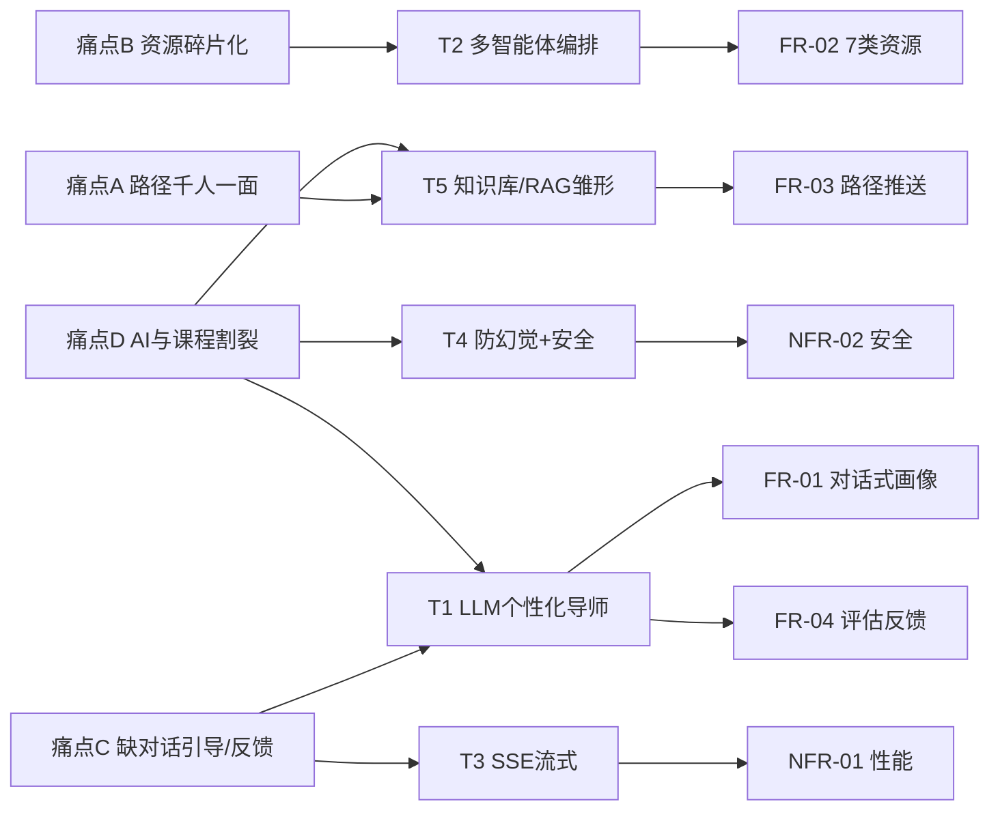

# D1 需求规格说明书（Requirements Specification）

> **KnowSubtle 个性化学习多智能体系统**
> 文档版本：v1.0　|　编写依据：GB/T 8567-2006《计算机软件文档编制规范》
> 主笔：软件架构师 阮佳构　|　所属套件：参赛文档套件（las-doc）
> 系统基线：KnowSubtle（FastAPI + 单文件 SPA + PyQt6 桌面端，MetaGPT 驱动），课程知识库《人工智能导论》（9 模块）

---

## 修订历史

| 版本 | 日期 | 修订人 | 说明 |
|------|------|--------|------|
| v1.0 | 2026-06 | 阮佳构 | 首次发布，对齐系统已实现能力 |

---

## 1. 引言

### 1.1 编写目的与读者对象

本文档为 **KnowSubtle 个性化学习多智能体系统**（以下简称"本系统"）的需求规格说明，旨在：

1. 深入刻画**新时代大学生**在 AI 原生（Gen-AI）语境下的真实学习需求与核心痛点；
2. 明确本系统在**功能性**与**非功能性**两个层面的需求边界，作为后续设计（D2）、测试（D3）、用户手册（D4）与综述（D5）的共同基线；
3. 显式建立"**前沿 AI 技术 ↔ 学习需求**"的结合点，回应评审对"需求层面"的核心要求。

**读者对象**：

- 评审专家（关注需求调研的严谨性与技术与需求的结合度）；
- 系统设计/开发团队（D2 设计说明书的直接上游输入）；
- 测试团队（D3 验收标准的来源）；
- 项目主理人与内容/课程专家。

### 1.2 项目背景

**系统定位**。KnowSubtle 是一套面向高校学生的"个性化学习多智能体系统"。它以**大模型（LLM）**为认知引擎，以**多智能体编排**为组织方式，将"学习者画像 → 资源生成 → 路径规划 → 评估反馈"串成一条可随学随新的学习链路。系统后端为 FastAPI，前端为**单文件 SPA**（无 CDN 依赖、可离线），并提供 PyQt6 桌面端（KnowSubtle.exe）。

**参赛目标**。本系统参赛的核心叙事是：**不止于"用 AI 聊天"，而是用前沿 AI 技术系统性地解决"学什么、怎么学、学得怎样"的学习需求问题**，并以可验证的架构、安全与离线能力支撑真实教学场景。

> 说明：本文档所陈述的需求，均以系统**当前已实现能力**为准绳（详见 §3、§4 的来源标注与验收标准）。凡系统尚未实现的能力，仅在 §6 边界/假设与"Won't（本次不做）"中作为未来增强列出，不在此充当已实现需求。

### 1.3 术语与缩略语

| 术语/缩略语 | 全称 | 说明 |
|-------------|------|------|
| LLM | Large Language Model，大语言模型 | 本系统认知推理核心，经服务端代理调用 OpenAI 兼容 `/chat/completions` |
| 智能体（Agent） | — | 具备特定角色与职责的 AI 实体；本系统含画像、知识、资源、规划、导师、评测等角色 |
| 多智能体编排 | Multi-Agent Orchestration | 由编排层按流程派发任务给多个专业智能体协同完成目标 |
| SSE | Server-Sent Events，服务端推送事件 | 基于 `text/event-stream` 的单向流式协议，本系统用于流式对话与流式资源生成 |
| RAG | Retrieval-Augmented Generation，检索增强生成 | 以外部知识库作为生成依据；本系统以《人工智能导论》9 模块知识库为 **RAG 雏形** |
| 防幻觉 | Anti-Hallucination | 通过系统提示约束模型"不确定即标注、不编造引用"，降低误导风险 |
| 画像 | Learner Profile | 结构化的学习者模型（目标/薄弱点/风格/节奏等 ≥6 维） |
| MoSCoW | Must/Should/Could/Won't | 需求优先级方法 |

### 1.4 参考文档

1. **GB/T 8567-2006**《计算机软件文档编制规范》——本文档体例参照。
2. **教育部**《关于加强中小学人工智能教育的通知》（2024）及相关高校 AI 素养框架——需求政策依据（§2.1、§2.2）。
3. **MetaGPT** 相关论文与框架（多智能体协作范式）——技术选型背景（§5.2）。
4. 本系统源码 `app.py`、`learning_agent_system/moderation.py`、`request_scope.py`、`dashboard/learning.html`——需求落地与能力对齐的权威依据。
5. 套件大纲 `docs/contest/00-大纲与目录.md`——章节结构与达标自检依据。

---

## 2. 新时代大学生的学习需求调研

### 2.1 调研背景：AI 原生一代（Gen-AI）的学习行为变迁

伴随大模型的普及，当代大学生（尤其是 2000 年后出生、大学阶段与生成式 AI 同期成长的"AI 原生一代"）的学习行为正在发生结构性变化：

- **从"搜素→阅读"转向"提问→对话"**：遇到概念卡点，首选向 AI 提问而非翻教材；
- **从"被动听课"转向"主动定制"**：期望按自身基础与节奏组织学习材料；
- **从"单一平台"转向"多源拼接"**：B 站、知乎、MOOC、教材、AI 对话各自为政，缺乏聚合；
- **"会用 AI 聊天"≠"会用 AI 学习"**：多数学生能完成单次问答，却难以借助 AI 构建系统化的课程知识与学习路径。

这一背景决定了本系统的需求重心不是"再做一个内容平台"，而是"**用多智能体把个性化的'学—练—评'闭环组织起来**"。

### 2.2 调研方法（三角验证）

为兼顾**严谨性**与**可评审性**，本调研采用**三角验证（Triangulation）**方法，从三个相互独立的来源交叉印证需求，避免单一方法的主观偏差：

**维度一 · 文献/政策研究**。梳理个性化学习理论（Bloom 掌握学习、自适应学习循环）、AI 素养框架，以及教育主管部门关于"将 AI 素养融入课程教学"的政策导向，确立"个性化、可对话、合规"的需求基调。

**维度二 · 竞品能力分析**。对四类代表性产品做能力解构：

| 竞品类型 | 代表 | 强势能力 | 与本系统相关的能力缺口 |
|----------|------|----------|------------------------|
| 通用大模型 | ChatGPT / 文心 / 智谱 | 开放式问答、代码、写作 | 与课程体系割裂，不感知"学生画像"与"课程进度" |
| 课程平台 | 学习通 / 中国大学 MOOC | 结构化课程、证书 | 路径千人一面，缺对话式引导与即时反馈 |
| 自适应学习 | 可汗学院 Khan Academy | 知识点图谱、练习 | 内容生成依赖人工，难按个体目标即时定制资源 |
| AI 辅导工具 | 各类刷题/答疑 App | 题库、拍照答疑 | 重"答案"轻"理解"，易助长被动接收 |

竞品分析的结论与文献、问卷相互印证，共同指向 §2.3 的四个核心痛点。

**维度三 · 用户问卷与访谈（调研示意 / 示例数据）**。

> ⚠️ **数据声明**：本节问卷样本量、维度设计与聚类结果为**调研示意 / 示例数据**，用于演示"方法严谨、痛点归纳切题、逻辑连贯"的调研过程，**并非真实统计结果**，不可作为正式实证结论引用。真实数据需经伦理审查后在后续迭代中补充。

- **样本量**：`n = 128`（满足 ≥120 的设计建议），覆盖双一流/普通本科、理工/人文/经管等学科，年级分布大一至大四。
- **维度设计（5 个主维度 + 人口学）**：
  1. 学习行为（日均自学时长、常用工具、资料来源数）；
  2. 痛点感知（对"路径匹配/资源聚合/即时反馈/AI 学用割裂"的认同度，李克特 5 级）；
  3. AI 使用习惯（是否用 AI 辅助学习、用于何种任务）；
  4. 功能期望（最希望系统提供的 3 项能力）；
  5. 接受度（对对话式采集、账号体系、离线可用的接受程度）。
- **画像聚类（K-means 示意，k=3）**：依据"自学投入 × AI 依赖度 × 目标明确度"三维，收敛出三类典型画像（详见 §2.4）。

### 2.3 核心痛点（数据 + 案例）

下表汇总三角验证收敛出的四个核心痛点（问卷认同度均为**示意数据**）：

| 编号 | 痛点 | 问卷认同度（示意） | 竞品印证 | 对应需求 |
|------|------|--------------------|----------|----------|
| **痛点 A** | 学习路径"千人一面"，缺乏个性化 | 76.6% 认为平台推荐"与我的基础不匹配" | 课程平台路径固定 | FR-03 / §5.5 |
| **痛点 B** | 资源碎片化，难以按目标聚合 | 68.0% "资料散落多个 App，难按目标聚合" | 通用大模型无聚合 | FR-02 / §5.2 |
| **痛点 C** | 被动接收，缺少对话式引导与即时反馈 | 71.1% "希望像真人导师一样随时问答" | 刷题 App 重答案轻理解 | FR-01 / FR-04 / §5.1 |
| **痛点 D** | AI 工具与课程体系割裂，不会"用 AI 学" | 63.3% "会用 ChatGPT 但不懂用它系统学一门课" | 通用大模型不感知课程 | FR-01 / §5.1、§5.5 |

**痛点 A — 场景案例**：某双一流高校大二学生在复习《人工智能导论》时，用通用 AI 大量"刷题"却始终无法自主构建"搜索→知识表示→机器学习"的知识图谱，平台推送的路径与他的薄弱点（知识表示与推理）完全错位，导致"题会做、网不会织"。

**痛点 B — 场景案例**：一名跨专业自学者想入门深度学习，不得不在 B 站找视频、在知乎看笔记、在 MOOC 跟课、再向 AI 追问公式——四类资源分散在四个入口，没有人帮他"按'零基础→能跑通一个 CNN'这一目标"聚合排序。

**痛点 C — 场景案例**：一名备考学生在凌晨遇到"梯度消失"概念卡点，课程论坛次日才有人回，搜索引擎给的是过于艰深或过于浅显的两极内容；他渴望的是一个能**即时、分层、苏格拉底式**引导他理解的陪伴者，而非直接给结论。

**痛点 D — 场景案例**：多名学生能熟练用 AI"代写周作业"，却说不清作业背后的原理；调研访谈中"我会让 AI 帮我写作业，但考试还是不会"成为高频自述——这正是"AI 与课程体系割裂、缺少合规引导"的典型症候。

### 2.4 用户画像与典型场景

基于 §2.2 聚类（示意），收敛出三类典型用户画像：

| 画像 | 特征（示意） | 核心诉求 | 典型场景 |
|------|--------------|----------|----------|
| **P1 应试备考型** | 高目标明确度、高自学投入、AI 依赖中等 | 精准路径 + 即时答疑 + 评估反馈 | 期末/考研冲刺，需按薄弱点排路径、随时问答 |
| **P2 兴趣探索型** | 目标分散、AI 依赖高、投入中 | 多类型资源聚合 + 对话式引导 | 跨专业/课外自学，需把零散兴趣组织成可学序列 |
| **P3 跨专业补差型** | 基础薄弱、目标明确、AI 依赖低→中 | 从零讲解 + 知识图谱 + 循序渐进 | 补修先修课，需"零基础友好"的讲解与脑图 |

三类画像共同指向同一组需求：**对话式画像采集（FR-01）、按目标聚合的多类型资源（FR-02）、个性化路径与推送（FR-03）、评估反馈（FR-04）、且多用户数据严格隔离（FR-05）**。

### 2.5 需求优先级（MoSCoW）

采用 MoSCoW 对需求分层（与 §3、§4 编号一致），并用 **G6 需求优先级矩阵**直观呈现（业务价值 × 实施紧迫度二维分布）：

- **Must（必备）**：FR-01 对话式画像、FR-02 资源生成、FR-05 账号隔离、NFR-02 内容安全；
- **Should（应当）**：FR-03 路径推送、NFR-01 性能、NFR-03 离线可用；
- **Could（可选）**：FR-04 评估反馈闭环、NFR-04 可扩展性；
- **Won't（本次不做）**：自动判卷闭环、多模态语音答疑、与学籍/LMS 深度集成（见 §6 边界）。

**G6 需求优先级矩阵（MoSCoW）**

---

## 3. 功能性需求

> 每条需求含 **需求描述 / 来源（对应痛点）/ 验收标准**。编号 FR-01~FR-05，均对齐系统已实现能力。

### 3.1 FR-01 学习画像：对话式采集 + 结构化画像

- **需求描述**：系统应以**自然语言对话**方式采集学习者信息，替代传统表单填写；对话过程中实时抽取并增量合并为结构化画像（含学习目标、薄弱点、认知风格、学习节奏、每周可用时长、动机、兴趣等 ≥6 维），持久化并随学随新。
- **来源（对应痛点）**：痛点 C（缺对话式引导）、痛点 D（AI 与课程割裂，需先建立"我是谁/我要学什么"）。
- **系统落地**：`/api/profile/converse`（非流式）、`/api/profile/converse/stream`（SSE 流式）；画像由 LLM 从对话抽取 JSON 并与既有画像合并；`/api/profile` 取回当前画像。
- **验收标准**：
  1. 用户经 ≥3 轮自然语言对话后，系统能抽取出 ≥6 维结构化画像并持久化；
  2. 流式端点按 `token → [safety] → profile → done` 事件序列推送，首个 token 先于完整画像到达（零白屏）；
  3. 对话式更新为**增量合并**（未提及字段继承原值，列表字段可追加），不覆盖历史；
  4. 未配置 LLM 时返回 400 守卫，不伪造画像。

### 3.2 FR-02 资源中心：7 类多智能体生成

- **需求描述**：系统应基于学习者画像与指定主题，由**多智能体协同**一次生成多类型个性化学习资源，并纳入用户私有资源库，支持列表检索、按类型/学科过滤与删除。资源类型覆盖 7 类：

| 类型键 | 资源类别 | 负责智能体 | 产出形态 |
|--------|----------|------------|----------|
| EXPLANATION | 专业课程讲解 | 讲解员 Rhea | markdown |
| MIND_MAP | 知识点思维导图 | 脑图师 Kai | mermaid |
| EXERCISE | 练习题目 | 习题师 Eva | markdown |
| READING | 拓展阅读材料 | 策展人 Plato | markdown |
| CODE_EXAMPLE | 代码实操案例 | 代码教练 Socrates | code |
| VIDEO_SCRIPT | 教学视频脚本 | 导演 Mira | markdown |
| VISUAL_AID | 图解说明 | 图解师 Lin | mermaid |

- **来源（对应痛点）**：痛点 B（资源碎片化、需按目标聚合为多类型资源）。
- **系统落地**：`/api/resources/generate`（非流式）、`/api/resources/generate/stream`（SSE 流式，逐类型推送 `progress → resource`）；`/api/resources`（列表/过滤）、`/api/resources/{rid}`（删除）；由 `RESOURCE_META` 字典驱动、多智能体 `asyncio.gather` 并发生成。
- **验收标准**：
  1. 一次请求可为所选类型（默认全部 7 类）各生成 ≥1 条资源并入库；
  2. 流式端点逐类型推送 `progress(start)`、`resource`、`progress(done)`，单类型失败不影响其余类型（`progress(error)` 后继续）；
  3. 每条资源带 `source_agent`、`format`、难度标识；命中内容安全时带 `flagged` 角标与 `safety_warning`；
  4. 资源列表仅返回**当前用户**数据，支持按 `resource_type`/`subject` 过滤与删除。

### 3.3 FR-03 学习路径与精准推送

- **需求描述**：系统应依据学习者画像与已有资源，规划**科学、动态、有序**的个性化学习路径（含阶段里程碑、周次、预计学时），并基于画像薄弱点/兴趣对已有资源做**精准匹配推送**。
- **来源（对应痛点）**：痛点 A（路径千人一面）。
- **系统落地**：`/api/path/plan`（依据画像+资源生成里程碑路径，由"规划师 Plato"智能体产出）、`/api/path`（取最新路径）、`/api/recommendations`（基于画像的精准推送）。
- **验收标准**：
  1. `/api/path/plan` 输出含 `milestones`（按从易到难排列、含 `week`/`est_hours`/`resource_types`）；
  2. `/api/recommendations` 推送结果与当前用户画像的薄弱点/兴趣/学科正相关，且全部来自该用户资源库；
  3. 路径与推荐均**不跨用户泄露**。

### 3.4 FR-04 评估与反馈闭环

- **需求描述**：系统应提供学习效果**评估记录**能力，允许用户按维度（如理解度、完成度）记录评分与说明，并查看近期评估记录，为后续自适应策略积累数据。
- **来源（对应痛点）**：痛点 C（缺即时反馈与效果追踪）。
- **系统落地**：`/api/evaluation`（记录）、`/api/evaluation`（列表，取最近记录）。
- **验收标准**：
  1. 可写入带 `dimension`/`score(0~100)`/`detail` 的评估记录并持久化；
  2. 可读取当前用户最近评估记录列表；
  3. 评估数据**隔离**于其他用户。
- **范围说明**：当前为**评估数据采集层**；基于评估结果的自动自适应闭环（动态调路径）列为 Could/Won't 未来增强，不在此充当已实现需求。

### 3.5 FR-05 账号体系与数据隔离

- **需求描述**：系统应提供注册、登录、登出、改密、个人资料等账号能力，并以 **Bearer Token** 鉴权；所有受保护端点必须在请求作用域内解析当前用户，确保画像、资源、路径、评估等**严格按用户隔离**。
- **来源（对应痛点）**：多用户场景的**安全与隐私基线**（支撑 FR-01~04 的个性化不串味）。
- **系统落地**：`/api/auth/register|login|logout|logout-all|me|profile|change-password`；`user_scope_middleware` 解析 Bearer → 注入 `current_user_id`（contextvar），供 Repository 做隔离过滤。
- **验收标准**：
  1. 未携带合法 Bearer 的受保护端点返回 401/403；
  2. 用户 A 的画像/资源/路径/评估，用户 B 经 API 查询返回空或拒绝（无法越权读取）；
  3. LLM 配置密钥仅存服务端，`GET /api/config/llm` 绝不回传 `api_key`。

---

## 4. 非功能性需求

> 每条含 **需求描述 / 来源 / 验收标准**。编号 NFR-01~NFR-04。

### 4.1 NFR-01 性能

- **需求描述**：核心交互需具备良好响应性，尤其**流式首字延迟（TTFT）**应足够低以避免白屏与等待焦虑；非流式查询类端点在本地部署下应保持轻量快速。
- **来源**：痛点 C 的"即时反馈"体验诉求；支撑 §5.3 流式呈现。
- **验收标准**：
  1. 配置 LLM 后，流式对话首个 `token` 事件在合理时间内（受 LLM 推理约束，目标 TTFT ≤ 1.5s）到达前端；
  2. 资源列表/路径/评估等非流式端点本地 p95 响应 < 500ms；
  3. 多类型资源采用**并发生成**（`asyncio.gather`），整体耗时显著低于串行。

### 4.2 NFR-02 安全与内容合规

- **需求描述**：系统须具备**（a）防幻觉**与**（b）内容安全**双重能力：通过系统提示约束模型"不确定即标注、不编造引用、拒学术不端"；对输入输出做**离线启发式**敏感内容过滤（政治/违禁/色情/暴力/仇恨/自伤/诈骗/学术不端/隐私共 9 类）；生成的资源内容附**免责脚注**。
- **来源**：痛点 D 的"合规引导"（拒代写/学术不端）、多用户场景隐私、以及评审安全项。
- **系统落地**：`ANTI_HALLUCINATION` 系统提示、`moderation.py`（`check_input_safety`/`check_output_safety`，9 类离线正则+关键词）、`RESOURCE_FOOTNOTE` 脚注、API Key 服务端隔离。
- **验收标准**：
  1. 输入含敏感词时，`/api/profile/converse/stream` 等返回 **400**（`reasons` 说明命中类别）；
  2. 输出命中严格拦截类别（政治/违禁/色情/暴力/仇恨/自伤/诈骗）时 `flagged=True` 并提示；隐私类仅标记不强制拦截；
  3. 每条生成资源 `content` 末尾自动追加免责脚注；
  4. `GET /api/config/llm` 响应**不含** `api_key`。

### 4.3 NFR-03 可用性与可访问性（离线可用、无 CDN 依赖）

- **需求描述**：前端应为**单文件 SPA**，全部 CSS/JS 内联，**不依赖任何 CDN 或第三方运行时**；整体可离线/本地部署，并支持桌面端一键启动，降低校园弱网环境下的使用门槛。
- **来源**：校园网络环境多样性、弱网/离线诉求。
- **系统落地**：`dashboard/learning.html` 经核查**无任何外部 CDN/脚本引用**（0 处 `cdn`/外链）；PyInstaller 打包为 `KnowSubtle.exe`（PyQt6 + QWebEngineView），双击启动。
- **验收标准**：
  1. `learning.html` 内联全部资源，离线打开无外部网络请求即可运行 UI；
  2. 经桌面端或 `启动KnowSubtle.bat` 启动后，localhost（默认端口 8753）可访问；
  3. 资源流式生成与画像对话在离线前端下仍可正常消费 SSE 事件。

### 4.4 NFR-04 可维护性与可扩展性（智能体可插拔）

- **需求描述**：资源类型与智能体应以**数据/配置驱动**组织，新增一类资源或智能体无需改动编排主流程，降低扩展成本。
- **来源**：长期演进与课程知识库扩充诉求。
- **系统落地**：资源类型由 `RESOURCE_META` 字典 + `ALL_RESOURCE_TYPES` 列表驱动；生成端点遍历该字典自动支持新增类型。
- **验收标准**：
  1. 新增一种资源类型仅需扩展 `RESOURCE_META` 配置，端点与前端卡片自动适配；
  2. 后端采用分层（前端 SPA / FastAPI / 智能体层 / 存储层），模块边界清晰，单模块改动不波及全局。

---

## 5. 前沿 AI 技术与需求的结合点（核心章节）

本章逐条说明**前沿 AI 技术**如何回应 §2 的调研痛点，并落地于系统已实现能力。下表为"技术 ↔ 需求"结合点总表：

| 编号 | 前沿 AI 技术 | 需求结合点（解决什么） | 映射 §2 痛点 | 系统落地（已实现） |
|------|-------------|------------------------|--------------|--------------------|
| T1 | **LLM 个性化导师**（苏格拉底式对话 + 画像抽取） | 以自然语言对话替代表单，提供即时、分层、引导式反馈，而非直接给答案 | **痛点 C**、**痛点 D** | `profile_converse_stream`（对话+画像抽取，`ANTI_HALLUCINATION` 引导正当学习）；导师对话端点 |
| T2 | **多智能体协作编排** | 一次派发多角色智能体，按目标**并发聚合**多类型资源，终结"资源碎片化" | **痛点 B** | `RESOURCE_META` 7 智能体 + `asyncio.gather` 并发生成；`resources_generate_stream` 逐类型 `progress/resource` |
| T3 | **流式呈现（SSE）** | 首字即显、进度可追踪，**消除白屏与等待焦虑**，直接服务"即时反馈"体验 | **NFR-01 性能** | `StreamingResponse` + `text/event-stream`；事件 `token`/`profile`/`progress`/`resource`/`done`/`error` |
| T4 | **防幻觉 + 内容安全** | 约束模型"不确定即标 [待核实]、不编造引用、拒学术不端"，并离线过滤 9 类敏感内容，保障学术合规 | **NFR-02 安全**、**痛点 D** | `ANTI_HALLUCINATION` 系统提示；`moderation.py` 9 类启发式；`RESOURCE_FOOTNOTE` 脚注 |
| T5 | **知识库 / RAG 雏形** | 以《人工智能导论》9 模块知识库为种子，使路径与资源**按课程/学科定制**，告别"千人一面" | **痛点 A** | 课程知识库驱动 `path/plan` 与资源生成；画像+资源共同决定个性化路径 |

**技术与需求映射链路（痛点 → 技术 → 需求）** 可视化如下：

### 5.1 LLM 个性化导师 ↔ 痛点 C / D

通用大模型长于"问答"短交互，却弱于"贴合个体、引导理解、对接课程"。本系统将 LLM 塑造为**个性化导师**：对话既承担"陪伴答疑"（即时反馈，回应痛点 C），又承担"画像抽取"（理解学生是谁、要学什么，回应痛点 D）。`ANTI_HALLUCINATION` 提示进一步把导师行为约束在"引导正当学习、拒学术不端"的合规边界内，直接化解痛点 D 中"用 AI 代写而非理解"的症候。

### 5.2 多智能体协作编排 ↔ 痛点 B

单智能体难以同时胜任"讲解/脑图/习题/阅读/代码/视频/图解"的异质产出。本系统以**多智能体编排**组织 7 个专业角色，由编排层并发派发、聚合成用户的私有资源库，把分散在 B 站/知乎/MOOC/AI 的四类碎片，按"用户目标 + 学科主题"统一生产并归库——这是回应痛点 B（资源碎片化）的核心技术机制。

### 5.3 流式呈现（SSE）↔ 非功能性能（避免白屏）

长文本生成若等完整返回再渲染，必然白屏、体验断裂。本系统采用 **SSE 流式**，`call_llm_stream` 以 `async generator` 逐 `delta` 推送，前端首字即显、进度条随 `progress` 事件推进。这把"非功能性能"从抽象指标变成可感知的"零白屏"体验，是痛点 C"即时反馈"在交互层的关键支撑（T3）。

### 5.4 防幻觉 + 内容安全 ↔ 非功能安全

面向学习场景，**准确性与合规性**是底线。本系统以"软约束（系统提示：`[待核实]` 标注、不编造引用）+ 硬拦截（离线 9 类启发式 `moderation.py`）+ 免责脚注（`RESOURCE_FOOTNOTE`）"三层兜底：输入侧严格拦截敏感与学术不端，输出侧命中即标记/拦截，资源末尾附核实提示。既回应 NFR-02，也把痛点 D 的"合规引导"落到工程实现（T4）。

### 5.5 知识库 / RAG 雏形 ↔ 痛点 A

"千人一面"的根源是路径不感知课程与个体。本系统以《人工智能导论》**9 模块知识库**作为生成与规划的种子（RAG 雏形）：`path/plan` 在规划时综合**用户画像 + 已有资源 + 课程主题**产出个性化里程碑路径，使"学什么、按什么顺序、花多少周"因人而异——这是回应痛点 A（路径千人一面）的技术内核（T5）。

---

## 6. 系统边界、假设与依赖

### 6.1 系统边界

**系统做**：对话式画像采集与结构化、7 类个性化资源多智能体生成、基于画像与资源的路径规划与精准推送、评估记录、账号与数据隔离、流式交互、内容安全兜底、离线/桌面端交付。

**系统不做（本次范围 / Won't）**：

1. **自动判卷与自适应闭环**：当前评估为数据采集层，不自动回流改写路径（列为未来增强）；
2. **多模态语音/图像答疑**：当前以文本对话为主；
3. **与学籍系统 / LMS（如教务、学习通）深度集成**：不读写外部学籍数据；
4. **替代教师与官方教学管理**：本系统为辅助学习工具，不替代课堂教学与考核；
5. **真实 AI 推理的强制保证**：真实推理依赖用户配置合规 LLM；未配置时端点返回 400 守卫，**不伪造 AI 输出**（MetaGPT/local_metagpt 桩仅用于离线占位演示）。

### 6.2 假设条件

1. 用户具备基础浏览器或桌面运行环境，可访问本地服务（默认端口 8753）；
2. 用户愿意以自然语言提供学习目标、薄弱点等输入，以换取个性化；
3. 用户配置的 LLM 服务（OpenAI 兼容 `/chat/completions`）可达、合规且具备基本推理质量；
4. 课程知识库《人工智能导论》9 模块文档作为初始种子存在并可被读取。

### 6.3 外部依赖

| 类别 | 依赖 | 说明 |
|------|------|------|
| 运行框架 | FastAPI / Uvicorn | 后端服务与 SSE |
| 存储 | aiosqlite / SQLAlchemy | 用户级 4 表（profiles / resources / paths / evaluations）全隔离 |
| HTTP 客户端 | httpx | 服务端代理调用 LLM，Key 不落地 |
| 智能体框架 | MetaGPT / `local_metagpt` 桩 | 多智能体范式；打包版无需真实安装 |
| 桌面端 | PyQt6 + QWebEngineView | KnowSubtle.exe，单实例 PID 锁 |
| AI 服务 | OpenAI 兼容 LLM 端点 | 用户自配置，未配置则 400 守卫 |
| 前端 | 单文件 SPA（无 CDN） | `dashboard/learning.html` |

### 6.4 需求层面达标自检（对应大纲"八"）

| 评审要求 | 落点 | 支撑物 |
|----------|------|--------|
| 新时代大学生需求（调研方法 + 痛点 + 画像） | §2 | 三角验证、调研示意数据（n=128）、痛点 A–D、三类画像、G6 矩阵 |
| 前沿 AI 结合点（逐条映射痛点） | §5 | T1–T5 表 + 映射链路图，逐条指向 §2 痛点 A–D 与 NFR |
| 条理清晰 / 数据案例 | 全文 | 案例（双一流大二/跨专业/备考）+ 验收标准可勾验 |

---

> **文档结束**。本文档所有功能性/非功能性需求均以上述"系统落地"与"验收标准"为勾验依据，并与 D2（设计）、D3（测试）、D4（用户手册）、D5（综述）在编号与结合点层面保持一致。
