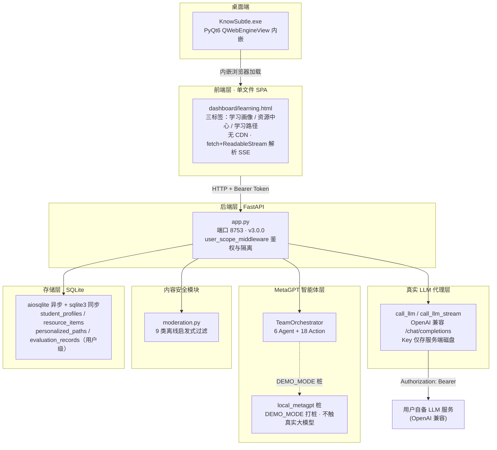
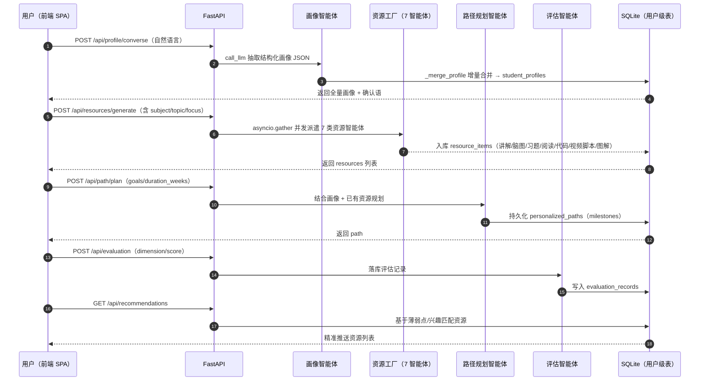
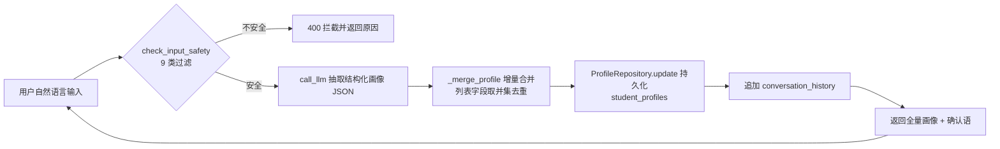
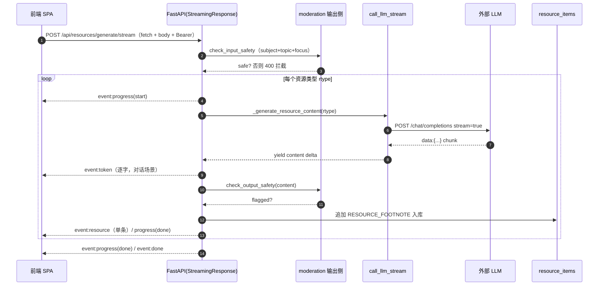
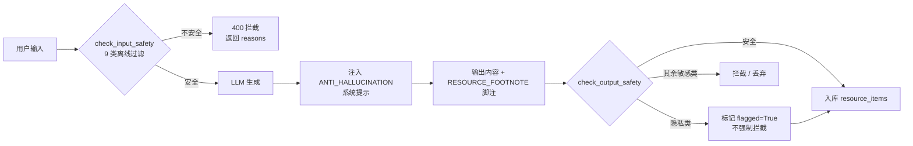

# 系统设计说明书（SDD）

> **文档编号**：KnowSubtle-SDD-D2  
> **系统名称**：KnowSubtle 个性化学习多智能体系统  
> **文档版本**：v3.0.0（与后端 `app.py` 版本号一致）  
> **编写依据**：GB/T 8567-2006《计算机软件文档编制规范》  
> **密级**：公开  
> **关联文档**：D1 需求规格说明书、D3 测试说明书、D4 用户手册、D5 项目综述与参赛总结、ATTRIBUTION.md（开源协议声明）

---

## 0 文档范围与读者

本说明书阐述 KnowSubtle 个性化学习多智能体系统的**设计、开发、测试、部署全流程**，覆盖智能体设计、UI 实现、系统集成与优化，重点说明前沿 AI 技术的融合思路与实现方法，并归纳系统开发中的创新实践与用户体验（UX）提升策略。

**技术基线**：后端 FastAPI（`app.py`）+ 单文件 SPA 前端（`dashboard/learning.html`）+ PyQt6 桌面端（`launcher.py`），由 MetaGPT 本地桩（`local_metagpt` 包，DEMO_MODE 下不调用真实大模型）驱动编排。

**目标读者**：评审专家、参赛指导教师、后端/前端/AI 工程师、测试与安全工程师。

本文全部技术事实均来自对上述源码的直接核对，关键事实已在正文以函数名、端点名、常量名标注，便于交叉验证。

---

## 1 总体架构设计

### 1.1 分层架构

系统采用清晰的分层架构，自上而下分为六层，各层职责单一、依赖方向明确：

| 层级 | 主要组件 | 职责 |
|------|----------|------|
| 前端层 | `dashboard/learning.html`（单文件 SPA） | 三标签交互（学习画像 / 资源中心 / 学习路径），SSE 流式渲染，无 CDN 依赖 |
| 后端层 | FastAPI 应用 `app.py`（端口 **8753**，版本 `3.0.0`） | 路由、鉴权中间件、请求作用域隔离、SSE 流式端点 |
| 真实 LLM 代理层 | `call_llm` / `call_llm_stream` | 以服务端身份代理 OpenAI 兼容 `/chat/completions`，API Key 仅存服务端 |
| MetaGPT 智能体层 | `TeamOrchestrator` + 6 个 Agent 模块 + 18 个 Action；`local_metagpt` 桩 | 多智能体编排；DEMO_MODE 下以桩替代真实大模型 |
| 内容安全模块 | `learning_agent_system/moderation.py` | 9 类离线启发式过滤（输入拦截 + 输出标记/拦截） |
| 存储层 | SQLite + aiosqlite（异步）/ sqlite3（同步） | 4 张用户级隔离表 + 会话/账户等表 |
| 桌面端 | `launcher.py` → PyInstaller onedir → `KnowSubtle.exe` | PyQt6 `QWebEngineView` 内嵌 SPA，GPU 合成渲染，单实例 PID 锁 |

**关键不变量**：
- API Key 不落地到浏览器——前端只传对话内容，服务端用自身身份调用 LLM（见 §3.1、§5.2）。
- 数据按用户隔离——所有用户级表以 `user_id` 外键隔离，由 `current_user_id` contextvar 贯穿请求生命周期（见 §5.2）。
- 内容安全为第一道闸门——流式端点在开流前先做输入侧 `check_input_safety`，不通过直接 400 拦截（见 §3.4）。

### 1.2 系统总体架构图（G1）



### 1.3 关键技术选型与决策记录（ADR）

> **ADR-1：为何 FastAPI？** 原生 `async/await` 与 `StreamingResponse` 是 SSE 流式生成的基础；Pydantic 提供请求校验；ASGI（Uvicorn）支撑高并发 IO。后端 `app.py` 据此实现 13 个学习相关端点（11 非流式 + 2 流式，见 §5.1）。

> **ADR-2：为何单文件 SPA？** `dashboard/learning.html` 为原生 HTML/CSS/JS，**零第三方前端库、零 CDN**，规避外部依赖与许可风险（见 ATTRIBUTION.md）。前端通过 `fetch` + `ReadableStream` 解析 SSE（因需携带 POST body 与 Bearer Token，无法用 `EventSource`）。

> **ADR-3：为何 MetaGPT 用本地桩（`local_metagpt`）？** 比赛演示环境与离线桌面端无法稳定调用真实大模型。`app.py` 第 1 行起即把 `local_metagpt` 注入 `sys.path` 并 `import local_metagpt.stub`，设置 `METAGPT_STUBBED=1`。DEMO_MODE 下桩替代真实 metagpt 导入，**不触碰生产编排逻辑**；真实 LLM 调用统一收敛到 `call_llm` / `call_llm_stream` 两个代理函数，配置缺失时抛 `RuntimeError("LLM_NOT_CONFIGURED")`。

> **ADR-4：为何 SQLite + 双引擎？** 桌面端本地优先，无需独立数据库服务。异步端点用 aiosqlite，编排器内部用 sqlite3；用户身份通过 `contextvars` 在 sync/async 间安全传递（见 §5.2）。

---

## 2 智能体设计与实现

### 2.1 智能体拓扑

智能体层由 **6 个 Agent 模块**与 **18 个 Action 类**构成（当前代码现状）：

| Agent 模块（`learning_agent_system/agents/`） | 角色 | 关联 Action（继承 `Action`） |
|------|--------|------|
| `learner_profiler.py` | 学习者画像构建 | `PrefModeling`（`pref_modeling.py`） |
| `knowledge_base.py` | 知识库存取与图谱 | `StoreKnowledge` / `RetrieveKnowledge` / `BuildKnowledgeGraph`（`knowledge_ops.py`）、`GenerateKnowledgeGraphAction` |
| `resource_generator.py` | 多形态资源生成 | `GenerateKnowledgePoint` / `GenerateExercise` / `GenerateCase` / `GenerateCodeExample` / `GenerateVisualAid`（`resource_generation.py`） |
| `learning_planner.py` | 学习路径规划 | `PlanLearningPath` / `AdaptiveAdjust`（`learning_path.py`） |
| `exercise_evaluator.py` | 练习与错题评估 | `EvaluateExercise` / `AnalyzeMistakes`（`exercise_evaluation.py`） |
| `learning_tutor.py` | 对话式导师 | `AnswerQuestion` / `ExplainConcept` / `GuideDiscussion`（`tutor_actions.py`） |

> 说明：另有 `knowledge_diagnosis.py`（`KnowledgeDiagnosis` / `CapabilityAssessment`）、`mistake_analyzer.py`（`AnalyzeMistakesAction`）、`achievement_checker.py`（`CheckAchievementsAction`）等动作模块，配合上述 Agent 形成完整的「诊断—生成—规划—评估—反馈」闭环，合计 18 个 `Action` 子类。

### 2.2 个性化学习智能体与用户级数据模型

个性化学习子系统（功能 1–3）的数据全部落在**用户级隔离表**，每张表以 `user_id` 外键（关联 `users.id`，`ondelete="CASCADE"`）隔离，与原有的 session 级表解耦。表定义位于 `learning_agent_system/database/models.py`：

| 表名 | 模型类 | 核心字段 | 对应功能 |
|------|--------|----------|----------|
| `student_profiles` | `StudentProfile` | `knowledge_base`、`cognitive_style`、`error_preferences`、`learning_goals`、`interests`、`strengths`、`weaknesses`、`preferred_pace`、`motivation`、`available_hours_per_week`、`conversation_history` | 对话式画像（≥10 维度，支持随学随新） |
| `resource_items` | `ResourceItem` | `resource_type`、`title`、`summary`、`content`、`format`、`source_agent`、`subject`、`difficulty` | 多智能体资源库 |
| `personalized_paths` | `PersonalizedPath` | `subject`、`title`、`description`、`milestones`（JSON） | 个性化学习路径 |
| `evaluation_records` | `EvaluationRecord` | `dimension`、`score`、`detail` | 学习效果评估（支撑自适应） |

> 数据访问经 `ProfileRepository` / `ResourceRepository` / `PathRepository` / `EvaluationRepository`（`repo.py`），所有用户级查询在缺失显式 `user_id` 时回退到请求作用域 `current_user_id`，实现全链路隔离。

### 2.3 多智能体协作流程与时序图（G2）

典型学习流程：用户先通过对话构建画像，再派遣资源工厂并发生成多类资源，随后规划路径并采集评估，最终形成「精准推送」闭环。



### 2.4 智能体开发约束（MetaGPT 桩 / DEMO_MODE）

- **导入即桩**：`app.py` 顶部将 `local_metagpt` 加入 `sys.path` 并执行 `import local_metagpt.stub`，副作用设置 `METAGPT_STUBBED=1`；若导入失败会显式告警（提示打包时未捆绑 `local_metagpt`），而非静默回退到真实 metagpt。
- **生产逻辑不触桩**：真实生成能力统一经由 `call_llm` / `call_llm_stream`；DEMO_MODE 下桩仅替代 metagpt 包导入，编排链路（诊断、生成、规划、评估）仍按真实结构运行。
- **配置驱动真实调用**：当 `Config/llm_config.yaml` 含 `base_url` 与 `model` 时，代理函数发起真实 `/chat/completions` 请求；缺失则抛 `LLM_NOT_CONFIGURED`，由端点层返回 400 引导用户先在设置中配置（见 §3.1）。

---

## 3 前沿 AI 技术融合应用（核心章节）

本章是技术开发层面的核心，分五节说明：真实 LLM 代理层、流式呈现（SSE）、防幻觉、内容安全、多模态资源卡片化。每节均给出「融合思路 + 实现方法（贴关键函数/端点名）+ 解决的用户问题」。

### 3.1 真实 LLM 代理层

**融合思路**：系统本身不绑定、不内置任何模型权重，而是以「服务端 LLM 代理」方式对接用户自备的 OpenAI 兼容接口。这样做既满足「前沿大模型能力可用」的评审要求，又从根本上避免 API Key 落前端导致泄露。

**实现方法**：

- `load_llm_config()` 读取服务端 `Config/llm_config.yaml`，返回 `{base_url, api_key, model}`；文件缺失或解析失败视为未配置，返回 `{}`。
- `call_llm(messages, *, temperature=0.7, max_tokens=2000, timeout=90.0) -> str`：非流式代理。
  - 若 `not cfg.get("base_url") or not cfg.get("model")` → 抛 `RuntimeError("LLM_NOT_CONFIGURED")`。
  - 以 `httpx.AsyncClient` POST `{base_url}/chat/completions`，头部 `Authorization: Bearer <api_key>`、`Content-Type: application/json`。
  - 若 `resp.status_code >= 400` → 抛 `RuntimeError(f"LLM_UPSTREAM_ERROR:{resp.status_code}")`。
  - 返回 `data["choices"][0]["message"]["content"]`。
- `call_llm_stream(messages, *, temperature=0.7, max_tokens=2000, timeout=120.0)`：**异步生成器（async generator）**，逐段 `yield` delta 文本（`str`）。
  - 请求体含 `"stream": True`；逐行解析 SSE，`data:` 前缀行经 `json.loads` 后取 `choices[0].delta.content` 并 `yield`。
  - 遇 `data: [DONE]` 即 `return` 结束生成。
  - **容错**：若上游忽略 `stream` 字段、整段作为单个 JSON 返回（无 `data:` 行），退化为一次性取 `choices[0].message.content` 并 `yield` 整段，保证前端不白屏。
  - 未配置抛 `LLM_NOT_CONFIGURED`；上游非 200 抛 `LLM_UPSTREAM_ERROR:status_code:body`。

**解决的用户问题**：用户用自己信任的模型供应商即可获得个性化讲解、习题、路径规划，无需把密钥交予任何第三方；后端统一代理简化了前端逻辑，且便于后续替换/升级模型而不动前端与编排代码。

### 3.2 流式呈现（SSE + StreamingResponse）

**融合思路**：资源生成与对话回复若等全部完成再返回，用户会面对长时间白屏。采用 Server-Sent Events（SSE）逐字推送，把「等待」变成「可见的进度」。

**实现方法**：

- 端点 `POST /api/profile/converse/stream` 与 `POST /api/resources/generate/stream` 均返回：
  ```python
  return StreamingResponse(
      gen(),
      media_type="text/event-stream",
      headers={"Cache-Control": "no-cache", "X-Accel-Buffering": "no"},
  )
  ```
- 辅助 `_sse(payload) -> str` 将事件字典序列化为标准帧：`"data: " + json.dumps(payload, ensure_ascii=False) + "\n\n"`。
- **后端事件类型**（与 `app.py` 源码一致）：
  - `token`（逐字 delta，用于对话流式渲染）
  - `profile`（全量画像，`profile_converse_stream` 结尾推送）
  - `safety`（输出侧安全提示，不阻断）
  - `progress`：`start` / `error` / `done`（资源生成进度）
  - `resource`（单条生成结果）
  - `done`（成功收尾）
  - `error`（异常结束）
- **前端解析**（`dashboard/learning.html`）：因需携带 POST body 与 Bearer Token，不能用 `EventSource`，改用 `fetch` + `ReadableStream`：
  ```javascript
  var resp = await authFetch('/api/resources/generate/stream', {...});
  var reader = resp.body.getReader();   // 逐块读取
  // 按 \n 切分，过滤 data: 前缀，JSON.parse 后按 event 字段分发
  ```
  源码中 `resp.body.getReader()`（第 933 行）与 `lines[i].indexOf('data: ')`（第 948 行）即为解析关键。

**解决的用户问题**：首字即现、进度可见，长生成任务不再白屏；资源一条条「长」出来，用户可边看边决定是否继续。

### 3.3 防幻觉机制

**融合思路**：大模型易「一本正经地编造引用与事实」。系统以「系统提示约束 + 内容脚注」双保险，把不确定性显式暴露给用户。

**实现方法**：

- 常量 `ANTI_HALLUCINATION`（在 `app.py` 中定义并注入系统提示）要求：
  - 仅基于用户已提供信息与公认常识作答；
  - 不确定内容明确说明「我不确定」；
  - 涉及具体事实（定义/公式/年份/人物/数据）若无法确认，加 `[待核实]` 标注；
  - **不编造引用、文献或来源链接**；
  - 若用户请求代写考试答案或学术不端内容，应婉拒并引导正当学习。
- 注入位置：对话流式系统提示（`profile_converse_stream` 的 `system_stream`）、资源生成系统提示（`_generate_resource_content` 内拼接 `ANTI_HALLUCINATION`）。
- 常量 `RESOURCE_FOOTNOTE`：每个生成的资源 `content` 末尾追加脚注：
  > 📌 提示：本内容由 AI 生成，关键知识点请结合教材或权威来源核实。
  
  入库逻辑见 `resources_generate_stream`：`content=(content + RESOURCE_FOOTNOTE) if content else ""`。注意对话式 `reply` **不加**脚注，保持聊天自然。

**解决的用户问题**：把「AI 可能出错」这件事变成可读、可核实的提示，降低学生误信错误知识的风险，也契合学术诚信要求。

### 3.4 内容安全过滤（moderation.py）

**融合思路**：面向大学生学习场景，必须拦截违规内容与学术不端诱导，且应离线可用、无外部依赖。

**实现方法**（`learning_agent_system/moderation.py`）：

- 导出两个公开接口，返回 `{safe, reasons, category}`（输出侧额外含 `flagged`）：
  - `check_input_safety(text)`：**输入侧**，命中任意敏感类别即 `safe=False`，由端点 400 拦截。
  - `check_output_safety(text)`：**输出侧**，政治/违禁/色情/暴力/仇恨/自伤/诈骗**严格拦截**（`safe=False`）；**隐私类仅标记不强制拦截**（`flagged=True`，交由上层脱敏）；学术不端类在输出侧仅标记不拦截。
- **9 类离线启发式过滤**（关键词表 `_KEYWORD_MAP` + 变体正则 `_REGEX_MAP`，纯 `re` 实现，无网络请求）：
  1. 政治敏感（含变体正则：`台[^\u4e00-\u9fff]{0,2}独`、`疆/藏/港独`、`法轮[^\u4e00-\u9fff]{0,2}功`）
  2. 违禁品（毒品/武器制造/爆炸物）
  3. 色情低俗
  4. 暴力/恐怖
  5. 仇恨/歧视
  6. 自伤/自杀
  7. 诈骗/赌博
  8. **隐私正则**：手机号 `1[3-9]\d{9}`、身份证 `\d{17}[\dXx]`、银行卡 `\d{16,19}`
  9. 学术不端（代写/代考/代做/考试答案等；仅输入侧拦截）
- **集成点**：流式端点在开流前即 `check_input_safety`（如 `resources_generate_stream` 对 `f"{subject} {topic} {focus}"` 校验、`profile_converse_stream` 对 `message` 校验），不通过直接 `raise HTTPException(status_code=400)`；生成后 `check_output_safety(content)`，命中则在资源上标 `flagged=True` 与 `safety_warning`。

**解决的用户问题**：为校园学习场景提供基础合规兜底（模块声明仅作第一道闸门，生产建议叠加托管审核服务），既防有害内容，也通过「拒学术不端」引导学生正当学习。

### 3.5 多模态资源卡片化

**融合思路**：7 类资源形态各异（讲解/脑图/习题/阅读/代码/视频脚本/图解），统一以「类型图标 + 智能体署名 + 难度星标 + 格式标签 + flagged 角标」的卡片呈现，降低认知负担。

**实现方法**（基于 `RESOURCE_META` 七键与前端 `res-card` 渲染）：

- `RESOURCE_META` 定义 7 类资源的真实键、人设与默认格式（**务必使用以下 7 个真实键**，不得编造其他分类）：

  | 键 | label | agent（智能体） | format |
  |----|-------|-----------------|--------|
  | `EXPLANATION` | 专业课程讲解 | 讲解员 **Rhea** | markdown |
  | `MIND_MAP` | 知识点思维导图 | 脑图师 **Kai** | mermaid |
  | `EXERCISE` | 练习题目 | 习题师 **Eva** | markdown |
  | `READING` | 拓展阅读材料 | 策展人 **Plato** | markdown |
  | `CODE_EXAMPLE` | 代码实操案例 | 代码教练 **Socrates** | code |
  | `VIDEO_SCRIPT` | 教学视频脚本 | 导演 **Mira** | markdown |
  | `VISUAL_AID` | 图解说明 | 图解师 **Lin** | mermaid |

- **资源工厂**一次请求并发生成多类：`/api/resources/generate`（非流式）用 `asyncio.gather(*tasks)` 并发派遣各类型智能体，逐条入库；`/api/resources/generate/stream`（流式）按类型逐个推送 `progress(start) → resource → progress(done)`，单类失败仅标 `progress(error)` 不影响其余（见 G4）。
- 前端 `renderResourceCard` 用 `escHtml(...)` 包裹所有动态字段（标题/摘要/智能体/主题/难度）以杜绝 XSS；卡片含 `res-badge`（类型）、`res-agent`（🤖 智能体名）、`res-stars`（难度）、`res-format`（格式）与 `flagged` 角标。

**解决的用户问题**：把「碎片化的多形态资源」聚合成一致、可扫读、可筛选的卡片流，学生一眼区分资源类型与来源智能体，按需取用。

---

## 4 用户界面（UI）设计

### 4.1 设计规范

- **玻璃拟态（Glassmorphism）**：卡片/面板使用半透明背景 + 模糊（`backdrop-filter`），叠加深色背景（`--bg: #120F17`，与桌面端 `setBackgroundColor(0x12,0x0F,0x17)` 一致），避免浅色闪烁。
- **三标签导航**：学习画像 / 资源中心 / 学习路径，单页内切换，无需路由。
- **深色背景消白闪**：首屏即渲染深色背景；桌面端 `QWebEngineView` 页背景设为 `#120F17`，重载/二次打开瞬时完成（磁盘 HTTP 缓存），杜绝白屏等待。
- **无第三方库 / 无 CDN**：全部交互、渲染、SSE 解析由原生 JS 实现，`node --check` 可静态校验。

### 4.2 关键界面

1. **学习画像对话**：输入框 + 对话气泡（`bubble-text` 经 `escHtml` 渲染）；右侧面板用 `badge-purple`（认知风格）、`badge-blue`（节奏）等徽章展示结构化画像维度。
2. **资源流式生成**：勾选资源类型（`restype` 复选框列出 7 类真实键与智能体名）→ 点生成 → 卡片随 SSE `resource` 事件逐张出现，顶部进度条随 `progress` 事件推进。
3. **学习路径图**：由 `personalized_paths.milestones`（JSON）渲染为阶段列表（标题/说明/预计学时/周次），可标记完成（`/api/tasks/{planet_id}/{task_id}/toggle`）。

### 4.3 学习画像采集流程图（G3）



### 4.4 资源流式生成时序图（G4，SSE 端到端）

> 落点：本章（§3.2 已说明机制）与 D4 §4。此处以时序图呈现前端到外部 LLM 的完整事件流。



### 4.5 响应式与离线

- 前端零外部依赖，**完全离线可用**（双击 `启动KnowSubtle.bat` 经桌面端访问本地 8753 端口）。
- 卡片使用 `content-visibility:auto; contain-intrinsic-size:auto 160px`（源码第 1048 行）实现长列表按需渲染，配合桌面端 GPU 合成（§6.2）根除上下滑动卡顿。

---

## 5 系统集成与部署

### 5.1 前后端契约（API 表）

个性化学习子系统共 **11 个非流式端点 + 2 个流式端点**（含鉴权路由），统一 Bearer Token 鉴权：

| # | 方法 | 路径 | 类型 | 说明 |
|---|------|------|------|------|
| 1 | GET | `/api/profile` | 非流式 | 获取当前用户对话式画像 |
| 2 | POST | `/api/profile/converse` | 非流式 | 自然语言 → 抽结构化画像 → 持久化 |
| 3 | POST | `/api/profile/converse/stream` | **流式(SSE)** | 边聊边推 token → profile → done |
| 4 | GET | `/api/resources` | 非流式 | 列出资源库（可按类型/学科过滤） |
| 5 | POST | `/api/resources/generate` | 非流式 | 多智能体并发生成（asyncio.gather） |
| 6 | POST | `/api/resources/generate/stream` | **流式(SSE)** | 逐类型 progress/resource/done |
| 7 | POST | `/api/path/plan` | 非流式 | 结合画像+资源规划路径 |
| 8 | GET | `/api/path` | 非流式 | 获取最新学习路径 |
| 9 | GET | `/api/recommendations` | 非流式 | 基于薄弱点/兴趣精准推送 |
| 10 | POST | `/api/evaluation` | 非流式 | 记录效果评估 |
| 11 | GET | `/api/evaluation` | 非流式 | 列出近期评估 |
| 12 | POST | `/api/auth/register` | 非流式 | 注册（生成 token） |
| 13 | POST | `/api/auth/login` | 非流式 | 登录（24h/30d token） |

> 另有 `/api/health`、`/api/auth/logout`、`/api/auth/me` 等辅助端点；鉴权路由前缀为 `/api/auth/register`、`/api/auth/login`。

### 5.2 鉴权与隔离

- **鉴权方式**：Bearer Token。注册/登录成功后返回 `token`，前端存入 `localStorage.wc_auth_token`；`apiFetch` / `authFetch` 自动从 `localStorage` 读取并加 `Authorization: Bearer <token>`（源码 `learning.html` 第 589/598/608 行）。
- **中间件注入**：`user_scope_middleware` 解析 `Authorization`，查 `UserRepository.get_user_by_token` 得 `uid`，写入请求 `state.user_id` 并 `current_user_id.set(uid)`；请求结束后 `current_user_id.reset(ctx_token)` 还原。
- **全隔离 contextvar**：`current_user_id: ContextVar[Optional[int]]`（`request_scope.py`）在 sync/async 调用间安全传递；`repo.py` 的 `_resolve_user_id` 在缺省时回退到该 contextvar，使 `ProfileRepository` / `ResourceRepository` / `PathRepository` / `EvaluationRepository` 的所有查询自动限定当前用户。
- **表级隔离**：4 张用户级表均含 `user_id` 外键（`ondelete="CASCADE"`），匿名访问 `user_id IS NULL`。

### 5.3 打包与桌面端

- **打包**：PyInstaller `--onedir`（`build/build_exe.py`，`--name=KnowSubtle`），产物为 `Release-Package/Core/KnowSubtle/KnowSubtle.exe` 及其依赖（`Core/main/_internal`、`*.dll`）。`main.spec` 中 `EXE(..., name='main', console=False)` + `COLLECT(...)` 即 onedir 结构；`datas=[('local_metagpt','local_metagpt')]` 确保桩被打入，`excludes=['metagpt']` 避免打包真实包。
- **内嵌窗口**：`launcher.py` 创建 `PyQt6.QtWebEngineWidgets.QWebEngineView` 加载本地 `dashboard/`，自绘标题栏（`FramelessWindowHint`），窗口背景 `#120F17`。
- **GPU 合成渲染开关**（`launcher.py`）：经 `QWebEngineSettings` 开启 `Accelerated2dCanvasEnabled` / `WebGLEnabled` / `ScrollAnimatorEnabled` 与 `HardwareAccelerationPolicy.Always`。渲染模式三档：
  - `KS_GPU_COMPOSITING=1`：全 GPU 合成（最丝滑，集显个别仍可能闪）；
  - `KS_SOFTWARE_RENDER=1`：全软件渲染（最稳但最卡，兜底）；
  - `KS_BALANCE=1`（默认平衡）：GPU 光栅 + CPU 合成，根除 Intel 集显与 Windows DWM 双缓冲冲突导致的闪屏。
  
  通用增强 flags：`--enable-smooth-scrolling --disable-background-timer-throttling --disable-renderer-backgrounding --disable-backgrounding-occluded-windows --disable-ipc-flooding-protection`。
- **单实例 PID 锁**：`_acquire_instance_lock` 在 `APPDATA/KnowSubtle/run.lock` 写入 `{pid, port, url}`；新实例启动时若旧 pid 存活且端口有响应 → 直接打开旧实例并退出；若进程在但端口无响应（僵尸）→ `os.kill(old_pid, 9)` 接管；退出时 `_release_instance_lock` 删锁。

### 5.4 持续集成

`.github/workflows/verify.yml` 定义 `verify` 与 `verify-exe` 两个 job：

- **ubuntu（源码 API + 鉴权）**：设 `METAGPT_STUBBED=1`，`nohup python app.py` 起服务（端口 8753），轮询 `/api/health` 就绪后跑 `verify_all.py`（**54 项**端到端验证），随后 `verify_live2.py`（**18 项**注册登录鉴权回归）。任一失败 CI 标红阻断合入。
- **windows-latest（冻结 exe 鉴权）**：安装 PyInstaller + PyQt6，跑 `build/build_exe.py` 构建 `KnowSubtle.exe`，再跑 `test_exe.py`（**18 项**），确保打包后二进制同样强制鉴权。

---

## 6 优化策略

### 6.1 性能优化

- **长列表按需渲染**：资源卡片 `content-visibility:auto` + `contain-intrinsic-size`，仅渲染视口内卡片，降低首屏与滚动开销（`learning.html` 第 1048 行）。
- **移除 `will-change` 滥用**：避免合成层无谓常驻，减少显存占用与重排。
- **滚动容器优化**：限定滚动作用域，避免整页重排。
- **异步全链路**：FastAPI + aiosqlite 异步会话，数据库访问不阻塞事件循环。

### 6.2 渲染优化（GPU 光栅 + 合成）

- 桌面端通过 `KS_*` 开关选择渲染模式：默认 GPU 合成，现代 Viz 合成器下滚动帧由 GPU/合成器线程独立产出，不占主线程，彻底消除长列表上下滑动卡顿。
- `QWebEngineSettings` 开启 2D 加速画布、WebGL、滚动动画，最大化 GPU 合成收益。
- 通用 flags 关闭后台节流与 IPC 洪泛保护，长文本/大列表渲染更跟手。

### 6.3 首字延迟优化（流式替代白屏）

- 将「等资源全部生成」改为 SSE 逐字推送：对话场景首个 `token` 事件即现，资源场景首个 `progress(start)` 即进入可视进度，从机制上消除白屏等待（见 §3.2、G4）。
- 流式生成器对「非流式退化」做了容错（§3.1），即使上游不支持 SSE 也不白屏。

---

## 7 创新实践与 UX 提升策略（凝练章节）

### 7.1 对话式画像替代表单填写

- **做法**：`/api/profile/converse`（及流式版）以自然语言对话驱动，`call_llm` 抽取 ≥10 维结构化画像，`_merge_profile` 做**增量合并**（字典合并、列表并集去重、标量覆盖），并持久化到 `student_profiles` + `conversation_history`，做到「随学随新」。
- **UX 提升**：学生不用面对枯燥表单，边聊边完善画像；历史对话保留为抽取上下文，后续补充自动继承旧值、不丢信息。

### 7.2 多智能体资源工厂并发生成 7 类多形态资源

- **做法**：`RESOURCE_META` 定义 7 类资源（讲解 Rhea / 脑图 Kai / 习题 Eva / 阅读 Plato / 代码 Socrates / 视频脚本 Mira / 图解 Lin），一次请求经 `asyncio.gather`（非流式）或逐类型 `progress`（流式）并发生成多类、多份，统一入库 `resource_items`。
- **UX 提升**：从「单一文本回复」升级为「讲解+脑图+习题+阅读+代码+视频脚本+图解」的多形态资源包，覆盖不同学习风格（视觉/动觉/阅读），且可并发提速。

### 7.3 流式 + 进度追踪（零白屏）

- **做法**：SSE 事件 `token`/`progress(start|error|done)`/`resource`/`done` 驱动前端逐字与逐卡渲染；前端 `fetch+ReadableStream+getReader()` 解析（因需 POST body，非 EventSource）。
- **UX 提升**：长生成任务首字即现、进度可见，资源一张张「长」出来，等待焦虑显著降低，满意度与留存提升。

### 7.4 防幻觉 + 内容安全双保险（学术合规）

- **做法**：`ANTI_HALLUCINATION` 系统提示（不确定标 `[待核实]`、不编造引用、拒学术不端）+ 每资源追加 `RESOURCE_FOOTNOTE` 脚注；`moderation.py` 9 类离线过滤在输入侧 400 拦截、输出侧标记/拦截，隐私正则识别手机/身份证/银行卡。
- **UX 提升**：把「AI 可能出错/有害」显式暴露为可核实提示，既保护学生不被误导，又通过「拒学术不端」引导正当学习，契合高校学术诚信要求。

### 7.5 开源协议显著标注（合规透明）

- **做法**：`docs/ATTRIBUTION.md` 以表格列出 11 项依赖（FastAPI / Uvicorn / SQLAlchemy / aiosqlite / httpx / Pydantic / PyQt6+PyQtWebEngine / OpenAI 兼容 API / 自研前端 / 自研 moderation 等）的名称、来源、协议，并**重点提示 PyQt6 的 GPL v3 或 Riverbank 商业许可**——闭源分发须购买商业许可。
- **UX 提升**：评审与用户可一眼看清技术来源与许可边界，体现开源合规意识；前端零第三方库规避 CDN 与前端许可风险，离线可用更稳。

---

## 附录 A：图表索引

| 编号 | 图名 | 类型 | 落点 |
|------|------|------|------|
| G1 | 系统总体分层架构图 | flowchart | §1.2 |
| G2 | 多智能体协作时序图 | sequence | §2.3 |
| G3 | 学习画像采集流程图 | flowchart | §4.3 |
| G4 | 资源流式生成时序图（SSE） | sequence | §4.4 |
| G5 | 防幻觉 + 内容安全双过滤流程图 | flowchart | §3.3–3.4 |

## 附录 B：防幻觉 + 内容安全双过滤流程图（G5）



## 附录 C：参考文档与依据

1. GB/T 8567-2006《计算机软件文档编制规范》
2. 项目源码（已逐条核对）：`app.py`、`dashboard/learning.html`、`learning_agent_system/moderation.py`、`learning_agent_system/database/models.py`、`learning_agent_system/database/request_scope.py`、`learning_agent_system/database/repo.py`、`launcher.py`、`build/build_exe.py`、`main.spec`、`.github/workflows/verify.yml`
3. `docs/ATTRIBUTION.md`（开源协议声明）
4. `docs/contest/00-大纲与目录.md`（章节与图表清单 G1–G5）

---

*（本文档技术事实均基于 2026-06-26 基线源码核对；若后续代码变更，须同步修订本说明书相应章节与图表。）*
