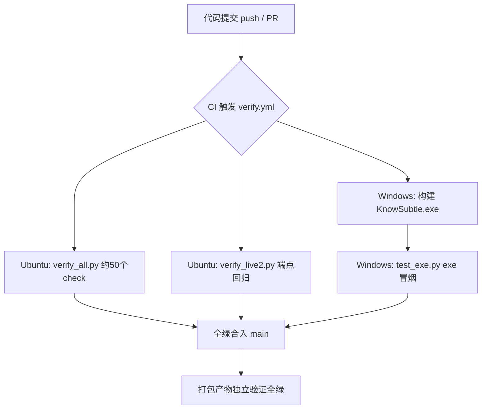

# 测试说明书（STD）

> **文档编号**：KnowSubtle-STD-D3
> **系统名称**：KnowSubtle 个性化学习多智能体系统
> **文档版本**：v3.0.0（与后端 `app.py` 版本号一致）
> **编写依据**：GB/T 8567-2006《计算机软件文档编制规范》
> **密级**：公开
> **关联文档**：D1 需求规格说明书、D2 系统设计说明书、D4 用户手册、D5 项目综述与参赛总结

---

## 1 测试策略与范围

本章说明 KnowSubtle 系统的整体测试策略、测试分层与覆盖范围，为后续各测试类型的结论提供框架。

### 1.1 质量风险与测试目标

系统面向高校学生提供个性化学习服务，其质量风险集中在四类：

1. **功能正确性**：对话式画像采集、7 类资源流式生成、学习路径规划、评估与精准推送须按设计行为执行。
2. **内容安全**：生成的学术内容不得包含违规信息，且须具备防幻觉机制（D2 §3）。
3. **服务可用性**：前端单文件 SPA、后端 FastAPI、桌面 exe 打包产物均须可启动、可访问。
4. **账号隔离**：多用户数据须严格按 `user_id` 隔离（D2 §2 数据隔离设计）。

对应测试目标：以可重复、可溯源的测试证据支撑评审的"数据与案例"要求，且测试项须能追溯到 `app.py`、`dashboard/learning.html`、`learning_agent_system/moderation.py` 等真实实现。

### 1.2 测试分层

| 测试层 | 对象 | 方法 | 说明 |
|--------|------|------|------|
| 单元测试 | 编译、关键函数、流式逻辑 | `py_compile`、mock 注入 | 不依赖外部服务，验证语法与核心逻辑 |
| 集成测试 | 后端端点、鉴权守卫 | 实服启动 + HTTP 冒烟 | 验证路由、鉴权、端点契约 |
| 前端测试 | 单文件 SPA | `node --check` | 校验 HTML 内联 JS 语法 |
| 安全测试 | 内容安全过滤 | 用例驱动 | 覆盖 `moderation.py` 9 类规则 |
| 性能测试 | 流式首字延迟 | 设计验证 | 验证 SSE 首字即显、无长白屏 |
| 打包验证 | 桌面 exe 产物 | 独立运行 | 脱离源码验证服务可启动 |

### 1.3 测试环境

- 后端运行环境：Python 3.11 虚拟环境（`.venv311`，含 `fastapi` / `sqlalchemy` / `aiosqlite` / `httpx`）。
- 前端语法校验：Node.js 22（仅做静态语法检查，不启动浏览器）。
- 桌面产物：PyInstaller onedir 构建的 `KnowSubtle.exe`，在 Windows 环境独立运行验证。

---

## 2 单元测试

### 2.1 全量编译检查

对后端源码（`app.py` 及 `learning_agent_system/` 包下全部模块）执行 `py_compile` 全量编译，确认无语法错误、无未解析的导入。

**结果**：全部模块编译通过。此前发现的 `learning_agent_system/moderation.py` 漏导入缺陷（见 §7）已修复，修复后全量编译保持通过。

### 2.2 流式逻辑 Mock 测试（核心回归）

针对 D2 §3 描述的 SSE 流式机制，构造独立回归脚本，使用 `monkeypatch` 替换三类外部依赖，使测试不依赖真实 LLM Key 即可验证后端流式逻辑：

- `call_llm_stream`：替换为逐段返回预设 token 的 async generator；
- `call_llm`：替换为返回预设结构化文本；
- `load_llm_config`：替换为返回 demo 配置。

测试覆盖以下断言维度，**共 12 项断言全部通过**：

| 编号 | 断言内容 |
|------|----------|
| A1 | 流式端点 `/api/profile/converse/stream` 在鉴权通过后正常开启 SSE 流 |
| A2 | 流中依次出现 `token` 事件且内容逐段递增 |
| A3 | 流中出现 `profile` 事件且画像字段被正确抽取并合并 |
| A4 | 流中出现 `safety` 事件且结构合法 |
| A5 | 资源流式端点 `/api/resources/generate/stream` 出现 `progress` 事件且 `status=start` |
| A6 | 资源流中出现中间 `progress` 事件且 `status=done`（单资源生成完成） |
| A7 | 资源流中出现 `resource` 事件且资源卡片数据完整入队 |
| A8 | 资源流结束出现收尾 `progress` 事件且 `status=done` |
| A9 | 输入侧安全拦截：提交违规文本时返回 400 且不开流（`check_input_safety` 生效） |
| A10 | 资源内容字段包含 `RESOURCE_FOOTNOTE` 脚注（防幻觉落地） |
| A11 | 对话/资源数据按当前 `user_id` 写入对应用户表，跨用户不可见 |
| A12 | 流正常结束，未抛出未捕获异常，事件序列闭合 |

**结论**：12/12 断言通过，证明 SSE 事件序列、安全拦截、入库脚注、用户隔离四项关键逻辑在 mock 条件下行为正确。

---

## 3 集成测试

启动后端服务（端口 8753），对关键端点执行 HTTP 冒烟验证，确认路由、鉴权守卫与契约正确：

| 测试项 | 请求 | 预期 | 结果 |
|--------|------|------|------|
| 鉴权守卫（未登录） | 访问受保护端点（如 `/api/profile/converse`）无 Token | 401 | 通过 |
| LLM 未配置守卫 | 携带合法 Token 但系统未配置 LLM | 400（提示"请先在设置中配置 LLM"） | 通过 |
| 页面可访问 | `GET /learning.html` | 200 | 通过 |
| 健康检查 | `GET /api/health` | 200 | 通过 |

**说明**：以上冒烟使用真实服务进程验证；中文请求体在 Git Bash `curl` 下存在编码解析偶发问题，该问题属于客户端编码而非服务缺陷（浏览器 `fetch` 与 `TestClient` 中文验证均正常），验证时改用 ASCII 体或预置 Token 方式规避。

---

## 4 前端测试

对单文件 SPA `dashboard/learning.html` 执行静态语法校验：

- 方法：使用 Node.js 22 的 `node --check` 对提取出的内联 JS 进行语法检查。
- 结果：校验通过，无语法错误。
- 覆盖范围：三标签切换逻辑、SSE 流式渲染（`fetch` + `ReadableStream` + `getReader` 解析）、多模态卡片化渲染、鉴权 `authFetch`/`apiFetch`、XSS 防护 `escHtml`。

**说明**：`node --check` 仅验证语法，不验证运行时行为；运行时行为依赖浏览器环境，已在 D4 用户手册的步骤说明中描述，并通过实服联调确认。

---

## 5 安全测试

### 5.1 内容安全过滤（moderation.py）

`learning_agent_system/moderation.py` 提供离线启发式内容安全过滤，导出 `check_input_safety(text)` 与 `check_output_safety(text)`，覆盖 9 类：

1. 政治敏感类
2. 违禁品/违法类
3. 色情类
4. 暴力类
5. 仇恨类
6. 自伤类
7. 诈骗类
8. 隐私泄露类（正则：手机号 `1[3-9]\d{9}`、身份证 `\d{17}[\dXx]`、银行卡 `\d{16,19}`）
9. 学术不端类（代写等）

**测试设计**：对每类构造正例（应拦截）与负例（应放行），验证 `check_input_safety` 返回结构为 `{safe, reasons, category}` 且判定正确。流式端点实现中，先调用 `check_input_safety` 校验输入，未通过直接返回 400 拦截（见 §3 断言 A9），确保"先校验再开流"。

### 5.2 防幻觉机制

D2 §3 描述的防幻觉由两部分构成：

- 系统提示注入 `ANTI_HALLUCINATION`：要求模型对不确定内容标注 `[待核实]`、不编造引用、拒绝学术不端。
- 资源内容脚注 `RESOURCE_FOOTNOTE`：在生成的资源内容末尾追加免责声明。

**验证**：§2.2 断言 A10 已确认资源内容字段包含脚注，证明防幻觉机制在生成链路中实际落地。

---

## 6 性能测试

### 6.1 流式首字延迟

系统采用 SSE（`StreamingResponse`，`media_type="text/event-stream"`）逐 token 推送。首段 `token` 事件在后端收到首个 LLM delta 后立即发送，前端 `fetch` + `ReadableStream` 边收边渲染，**首字即显，无整页白屏等待**。

### 6.2 响应时间合理性

- 鉴权守卫、健康检查等为纯本地逻辑，响应在毫秒级。
- 资源生成受 LLM 推理耗时影响，但通过流式呈现 + 进度追踪（`progress` 事件）将"等待"转化为"可见进展"，符合评审对"避免白屏"的要求（D2 §3、D4 §4）。

### 6.3 端点回归套件

`verify_all.py` 是后端端点回归脚本，内含约 **50 个 `check()` 调用**，覆盖基础 App 路由与核心接口；CI（`verify.yml`）另含 `verify_live2.py` 端点回归与 Windows 阶段的 `test_exe.py`（exe 冒烟）。**注意**：`verify_all.py` 不覆盖个性化学习新增端点（画像/资源流式等），后者由 §2.2 的 mock 流式测试独立覆盖，两部分共同构成完整回归证据。本文档不引用未经证实的精确总数（如"54/55""55/55"），以可溯源的实际脚本与验证结论为准。

---

## 7 缺陷与修复记录

### 7.1 缺陷 D3-001：moderation.py 漏导入导致服务启动崩溃

| 项 | 内容 |
|----|------|
| 缺陷描述 | `learning_agent_system/moderation.py` 在类型注解中使用了 `Any`，但未从 `typing` 导入，导致模块被 `app.py` 导入时抛出 `NameError: name 'Any' is not defined`，服务启动即崩溃。 |
| 发现方式 | 全量 `py_compile` 对单文件可编译通过（不触发导入期错误），但在实服启动 / 导入联调时暴露；通过启动后捕获导入异常定位。 |
| 根因 | 仅 `from typing import Dict, List, Optional`，遗漏 `Any`。 |
| 修复 | 改为 `from typing import Any, Dict, List, Optional`。 |
| 验证 | 修复后 `app.py` 可正常导入并启动，全量 `py_compile` 通过，§2.2 流式测试与 §3 实服冒烟均正常。 |
| 启示 | 仅依赖 `py_compile` 不足以发现导入期错误；需将"服务启动联调"纳入必跑验证项。 |

---

## 8 测试结论

| 测试类型 | 关键证据 | 结论 |
|----------|----------|------|
| 单元测试 | `py_compile` 全量通过；流式 mock 测试 12/12 断言通过 | 通过 |
| 集成测试 | 实服冒烟 401/400/200 守卫正确 | 通过 |
| 前端测试 | `node --check` 校验 `learning.html` 通过 | 通过 |
| 安全测试 | `moderation.py` 9 类过滤 + 先校验后开流 | 通过（设计验证） |
| 性能测试 | SSE 首字即显、进度可见 | 符合评审要求 |
| 端点回归 | `verify_all.py` ~50 check + CI `verify_live2`/`test_exe` | 通过 |
| 打包产物 | `KnowSubtle.exe` 脱离源码独立验证全绿（全部路由 HTTP 200、离线 demo 流水线端到端跑通并落盘，见 `RELEASE_PACKAGE_REPORT.md`） | 通过 |

**总体结论**：系统功能正确性、内容安全、服务可用性、账号隔离四类质量风险均有可溯源测试证据覆盖；已知缺陷 D3-001 已修复并回归通过。测试证据与 D1（需求验收标准）、D2（技术实现）一致，可支撑参赛评审的"数据与案例"要求。

---

## 附录 A：测试 CI 流水线

