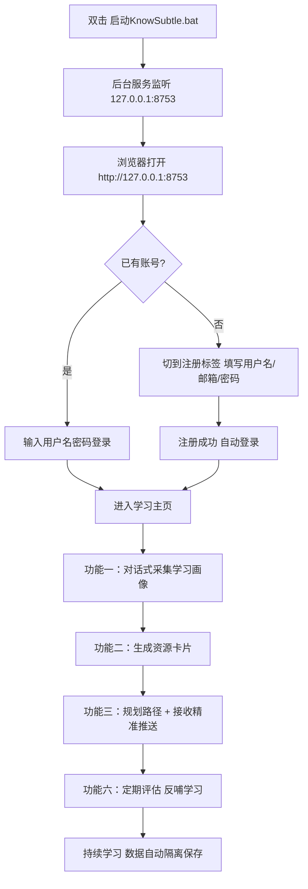

# KnowSubtle 用户手册

> 个性化学习多智能体系统 · 写给每一位爱学习的大学生
>
> 适用版本：v3.0.0 ｜ 访问地址：`http://127.0.0.1:8753`（或 `http://localhost:8753`）

---

## 这本手册适合谁

如果你是一名大学生，想要一个"懂你"的学习助手——它能摸清你的基础、自动给你生成讲解、脑图、习题、阅读材料和代码示例，还能规划一条专属于你的学习路径——那么 KnowSubtle 就是为你准备的。

本手册不要求你懂编程，也不要求你理解背后的多智能体技术。你只需要照着下面几步走，就能从"打开软件"一路走到"看到自己的学习路径"。

手册结构如下，你可以按顺序读，也可以直接跳到需要的章节：

- [§1 安装与启动](#1-安装与启动)
- [§2 注册与登录](#2-注册与登录)
- [§3 功能一：学习画像（对话式采集）](#3-功能一学习画像对话式采集)
- [§4 功能二：资源中心（生成与学习卡片）](#4-功能二资源中心生成与学习卡片)
- [§5 功能三：学习路径与精准推送](#5-功能三学习路径与精准推送)
- [§6 评估与反馈](#6-评估与反馈)
- [§7 常见问题（FAQ）与故障排查](#7-常见问题faq与故障排查)

---

## 1. 安装与启动

KnowSubtle 是一个"桌面程序 + 本地网页"的学习系统。你不需要把它部署到服务器上，也不用联网注册账号——所有数据都留在你自己的电脑里。启动它有两种方式，推荐第一种。

### 方式一：双击启动器（最简单）

1. 找到项目文件夹里的 **`启动KnowSubtle.bat`** 文件（它通常就在整个项目的根目录）。
2. **双击**它。
3. 启动器会自动打开后台服务程序 `KnowSubtle.exe`。稍等几秒，直到窗口里显示服务已经启动、正在监听 `127.0.0.1:8753`。
4. 打开你的浏览器（Chrome、Edge、Firefox 均可），在地址栏输入：

   ```
   http://127.0.0.1:8753
   ```

   或者：

   ```
   http://localhost:8753
   ```

5. 看到 KnowSubtle 的控制台页面，就说明启动成功啦。

> 💡 小提示：双击启动器后请**保持那个黑色窗口开着**。关掉它，后台服务就停了，网页也会连不上。如果你不小心关了，重新双击一次 `启动KnowSubtle.bat` 即可。

### 方式二：直接运行 exe 程序

如果你更习惯自己点开程序，也可以：

1. 进入项目里的 `Release-Package\Core\KnowSubtle\` 文件夹。
2. 双击 **`KnowSubtle.exe`**。
3. 同样等待服务启动完成，然后到浏览器访问上面的地址。

这两种方式效果完全一样，最终都是让本地网页仪表盘运行在 **8753 端口**上。

### 启动后你在浏览器里会看到什么

打开网页后，首先映入眼帘的是 **控制台（Console）** 页面，它整合了登录 / 注册入口。还没注册过时，你会看到"登录 / 注册"的切换标签。注册登录后，这里会变成你的学习总览入口，可以跳转到"智能学习""我的星球"等页面。

记住这个地址，以后每次想用 KnowSubtle，只要先启动程序、再打开这个网址就行。

---

## 2. 注册与登录

首次使用必须先有一个账号。账号信息只保存在你本机的数据库里，不会上传到任何云端。

### 注册新账号

1. 在控制台页面，点击登录框下方的 **"注册"** 标签（或类似切换按钮），切到注册表单。
2. 填写以下信息：
   - **用户名**：2–32 位，只能用字母、数字和下划线，例如 `xiaoming_2026`。
   - **邮箱**：填写真实格式即可，例如 `xiaoming@school.edu.cn`（仅用于标识，不会发送邮件）。
   - **密码**：设置一个你记得住的密码。
3. 点击 **"注册"** 按钮。
4. 注册成功后会**自动登录**，页面会跳转到你的学习主页，无需再手动登录一次。

> ⚠️ 如果提示"用户名已存在"，换一个用户名再试。用户名是你在系统里唯一的身份标识。

### 登录已有账号

1. 在控制台页面确保处于 **"登录"** 标签。
2. 输入你的用户名和密码。
3. （可选）勾选 **"记住我"**：勾选后登录状态可保持约 30 天，不勾选则约 24 小时。
4. 点击 **"登录"**，即可进入学习主页。

### 关于"登录状态自动保存"

你不用每次都记着 token 或手动复制什么。系统在你登录 / 注册成功时，会**自动把登录凭证（token）保存在浏览器本地**（保存在 `localStorage` 里的 `wc_auth_token` 这个位置）。只要你不主动登出、且没超过有效期，下次打开网页就能直接是登录状态。

### 登出

想退出当前账号时：

- 在页面里找到 **"退出登录 / 登出"** 按钮，点击即可。系统会清除本地的登录凭证并提示"已退出登录"。
- 如果你在别人的电脑上用过，建议额外选择 **"登出所有设备"**，把该账号的所有登录状态一次性吊销，更安全。

---

## 3. 功能一：学习画像（对话式采集）

学习画像是 KnowSubtle 的"地基"。它会通过**像聊天一样的一问一答**，慢慢摸清你的基础、目标和偏好，然后把它整理成一份专属你的学习档案。

### 进入学习画像

在控制台或"智能学习"页面，找到 **"学习画像 / 我的画像"** 相关入口，进入对话式采集界面。

### 操作步骤

1. 系统会先发来一句开场白，比如"你好，我是你的学习伙伴，先聊聊你的基本情况吧～"。
2. **像聊天一样回答它的问题**。它可能会问：
   - 你正在学什么科目 / 主题？
   - 你目前大概是什么水平（零基础 / 入门 / 进阶）？
   - 你每天大概能投入多少时间学习？
   - 你偏好图文讲解、还是看代码、还是做习题？
3. 它的回复是**逐字流式**出现的（像打字机一样一行行蹦出来），请稍等它说完。
4. 回答几轮后，系统会提示"画像已更新"或"已为你生成学习画像"。此时你的基础档案就建立好了。

### 界面说明

- **对话气泡**：你的问题在右侧，系统的提问与反馈在左侧（或按页面样式区分）。
- **流式输出**：回答是实时生成的，看到光标闪烁就说明还在生成中，别急着刷新页面。
- **画像状态**：部分页面会在侧边显示"画像完成度"或"已采集要点"，方便你了解还差多少。

### 示例

> **系统**：先告诉我，你最近最想搞懂的是哪门课或哪个知识点呀？
> **你**：我想学好《数据结构》里的"二叉树"。
> **系统**：好的～你之前写过二叉树的相关代码吗？还是完全从概念开始学？
> **你**：概念懂一点，但一写代码就懵。
> **系统**：明白了，那我会多给你配代码例子和习题。再问下，你每周能拿出几个晚上来练？
> **你**：大概三个晚上，每次一小时。
> **系统**：收到 ✅ 我已经把你的画像记下了：目标=二叉树，水平=概念入门/代码薄弱，偏好=代码+习题，节奏=每周 3 小时。接下来给你生成资源时会按这个来。

> 💡 学习画像不是一次性的。你随时可以回来继续聊，系统会增量更新你的档案。

---

## 4. 功能二：资源中心（生成与学习卡片）

资源中心是你真正的"学习材料库"。系统会根据你的学习画像，调用多个专属智能体，**实时生成**不同类型的学习资源，并以一张张"学习卡片"呈现给你。

### 资源都有哪几种

系统内置了多位"智能体老师"，每位负责一类资源：

| 资源类型 | 负责智能体 | 它给你什么 |
| --- | --- | --- |
| 讲解（EXPLANATION） | 讲解员 Rhea | 用通俗语言把概念讲清楚 |
| 脑图（MIND_MAP） | 脑图师 Kai | 一张知识思维导图，理清结构 |
| 习题（EXERCISE） | 习题师 Eva | 配套练习题与解析 |
| 阅读（READING） | 策展人 Plato | 精选延伸阅读材料清单 |
| 代码例子（CODE_EXAMPLE） | 代码教练 Socrates | 可直接参考的代码示例 |
| 视频脚本（VIDEO_SCRIPT） | 导演 Mira | 可直接拍摄/录屏的教学视频脚本 |
| 图解说明（VISUAL_AID） | 图解师 Lin | 一图讲清原理的结构化图解 |

> 共 **7 类资源**，分别对应 7 位具名角色智能体，由 `RESOURCE_META` 字典驱动、并发生成。

### 生成资源（流式）

1. 进入 **"资源中心 / 智能学习"** 页面。
2. 选择或输入你想生成资源的**主题**（例如"二叉树的遍历"）。
3. 选择资源**类型**（讲解 / 脑图 / 习题 / 阅读 / 代码 / 视频脚本 / 图解），或让系统按画像自动选；
4. 点击 **"生成"**。
5. 资源会**一边生成一边显示**（流式）：先出现标题，再逐段填充内容。请耐心等它生成完，期间不要关闭页面。
6. 生成完成后，这张资源会变成一张**学习卡片**，留在你的资源列表里。

### 查看与管理资源

- **卡片列表**：资源中心以卡片网格展示你已生成的资源。每张卡片显示标题、类型图标、生成时间。
- **打开卡片**：点开任意卡片可查看完整内容（讲解正文、脑图、习题、代码等）。
- **删除资源**：对某张不再需要的卡片，点击卡片上的 **"删除"** 按钮即可把它从你的列表移除（只删你自己的，不影响别人）。

### 示例：一张"代码例子"卡片

> **卡片标题**：二叉树前序遍历（Python）
> **类型**：💻 代码例子 · Socrates
> **内容摘要**：
> ```python
> def preorder(root):
>     if not root:
>         return
>     print(root.val)        # 先访问根
>     preorder(root.left)    # 再左子树
>     preorder(root.right)   # 最后右子树
> ```
> 配套说明：前序="根→左→右"，常用于复制树结构……

---

## 5. 功能三：学习路径与精准推送

当你有了画像、也攒了一些资源，系统就能帮你把零散的学习内容**串成一条路**，并在合适的时间把最合适的资源**精准推**到你面前。

### 规划学习路径

1. 进入 **"学习路径 / 路径规划"** 页面。
2. 点击 **"规划路径"**（或 `开始规划`）。
3. 系统会结合你的学习画像和已有资源，生成一份**分阶段的学习路线**，例如：
   - 阶段 1：二叉树概念与术语（配讲解卡片）
   - 阶段 2：三种遍历的代码实现（配代码 + 习题卡片）
   - 阶段 3：综合应用题（配阅读 + 习题卡片）
4. 路径生成后，你可以在页面上看到整体路线图和各阶段的进度。

### 精准推送（推荐）

- 系统会根据你当前所在的阶段、完成情况和学习节奏，**主动推荐**下一步该看的资源。
- 在控制台或"智能学习"页，留意 **"为你推荐 / 今日推荐"** 区域：那里出现的就是系统认为你"现在最该学"的内容。
- 点击推荐卡片即可直接开始学习，不用自己再去翻资源中心找。

> 💡 路径和推荐都会随你的学习进展**动态调整**。你学得越快，它推得越靠前；某块反复卡住，它会多给你补相关资源。

---

## 6. 评估与反馈

学完一段之后，系统可以对你的掌握情况做一次**评估**，帮你确认"到底学会了没"。

### 进行一次评估

1. 进入 **"评估 / 学习反馈"** 相关入口。
2. 选择要评估的主题或阶段（通常系统会默认选中你正在学的那个）。
3. 点击 **"开始评估"**。
4. 系统会给出若干题目或问答，你作答后提交。
5. 评估完成后，页面会显示你的**掌握度结果**与薄弱点提示。

### 用评估结果反哺学习

- 评估结果会回写到你的学习档案，影响后续的资源生成和路径推荐。
- 如果某块评估偏弱，建议回到资源中心针对性补卡，或让系统重新规划路径。
- 定期进行小评估，比"学完一大堆再测"效果更好。

---

## 7. 常见问题（FAQ）与故障排查

### Q1. 打开网页提示"请先配置 LLM"或"未配置大模型"？

KnowSubtle 需要接入一个大语言模型（LLM）才能生成内容。如果还没配置，生成资源或对话时会收到类似"请先在设置中配置 LLM"的提示。

**怎么解决：**
1. 在系统里找到 **"设置 / LLM 配置"** 入口。
2. 填入你的模型服务地址（base_url）、模型名（model）和 API Key。
3. 保存后重新尝试生成。

> 🔒 安全说明：你填的 API Key **只保存在本机服务端**的配置文件中，**不会**回传到前端页面，别人打开你的网页也看不到你的 Key。

### Q2. 点"生成"后内容半天不出来 / 一直转圈？

资源是**流式生成**的（一边生成一边显示），尤其是脑图、代码这类内容需要一点时间。

- 请耐心等待，不要反复点击"生成"或刷新页面，否则会中断生成。
- 如果等了很久（超过一两分钟）仍无反应，先确认 Q1 里的 LLM 是否已正确配置；配置无误仍卡住，可尝试重启程序（见 Q6）。

### Q3. 我的学习数据会被别人看到吗？/ 换账号数据会混吗？

不会。系统对每位用户做了**数据隔离**：你的画像、资源、路径、评估记录都只属于你的账号，和其他账号完全分开。即使同一台电脑上换了账号登录，看到的也是各自独立的内容，不会串台。

### Q4. 忘记密码了怎么办？

在登录页通常有 **"忘记密码 / 修改密码"** 入口，登录后也可在设置里 **"修改密码"**。由于账号仅存于本机，若你完全无法验证身份，可联系负责本机的管理员重置（参赛演示环境一般可重新注册一个新账号使用）。

### Q5. 浏览器显示"无法访问此网站 / 连接被拒绝"？

多半是后台服务没起来：
1. 检查 `启动KnowSubtle.bat` 那个黑色窗口是否还开着（别关）。
2. 确认地址是 `http://127.0.0.1:8753`，端口是 **8753** 而不是别的数字。
3. 若窗口已关，重新双击 `启动KnowSubtle.bat` 再试。

### Q6. 程序卡死或页面一直连不上，怎么"重启"？

1. 关掉 `启动KnowSubtle.bat` 打开的那个黑色窗口（或在任务栏结束 `KnowSubtle.exe` 进程）。
2. 重新**双击 `启动KnowSubtle.bat`**。
3. 等待服务重新监听 8753 端口，再刷新浏览器页面。

### Q7. 登录后过一会儿突然要重新登录？

登录状态有有效期（勾选"记住我"约 30 天，否则约 24 小时）。过期后系统会提示"登录已失效，请重新登录"，并自动跳回登录页。重新登录即可，你的数据都还在。

### Q8. 生成的资源我想全部清空重来？

在资源中心逐张点击卡片上的"删除"即可移除。删除只影响你当前账号的资源，不会导致程序异常。

---

## 附：首次使用流程图

下面这张图帮你快速建立"从零到用起来"的整体印象：



---

## 写在最后

KnowSubtle 的设计理念是"越用越懂你"：你聊得越多、学得越多，它给出的画像、资源和路径就越贴合你。第一次用不用追求一步到位——先把画像聊出来，再生成两三张资源卡片感受一下，剩下的功能会在你日常学习中自然展开。

祝你学习愉快，星球常青 🌱
