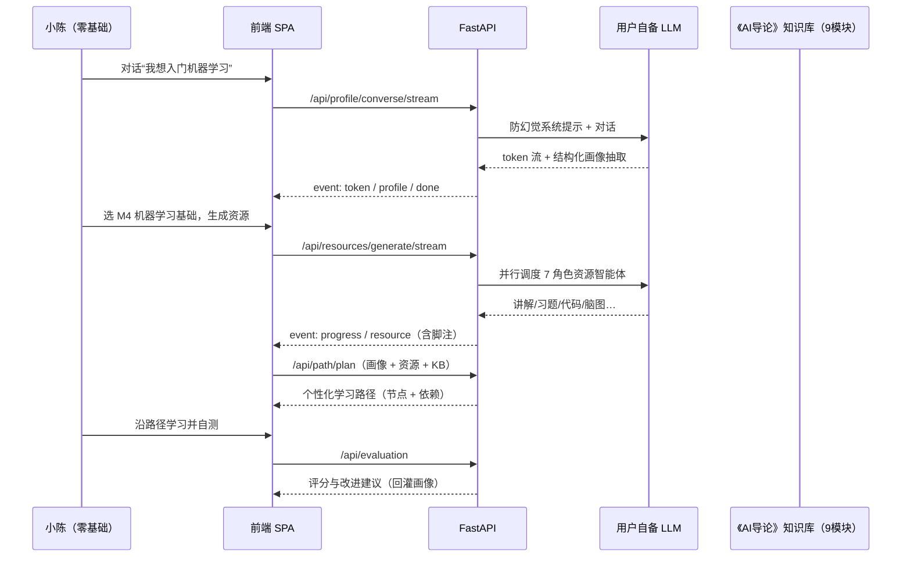
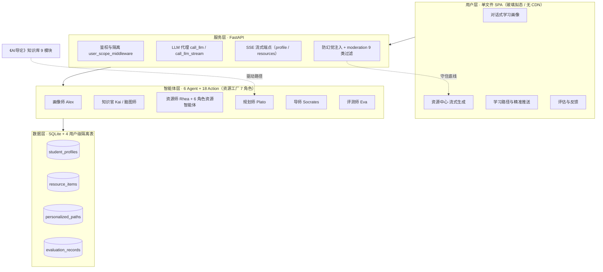

# D5 · 项目综述与参赛总结（Project Overview & Competition Summary）

> **系统**：KnowSubtle 个性化学习多智能体系统
> **基线**：FastAPI + 单文件 SPA + PyQt6 桌面端，MetaGPT 驱动；课程知识库《人工智能导论》（9 模块）
> **定位**：本项目综述凝练项目价值、创新点与证据，是评审快速抓重点的材料；需求层面见 D1、技术开发层面见 D2，数据与案例见 D3/D4，本篇负责综合闭环。
> **规范**：GB/T 8567-2006《计算机软件文档编制规范》+ 高校课程设计文档惯例

---

## 1. 项目背景与价值主张

### 1.1 背景：AI 原生一代的学习困境

当代大学生是伴随大模型成长的「AI 原生一代」。他们普遍使用 AI 工具，却仍被困在三类结构性矛盾中：

- **工具很强、路径很弱**——能向通用大模型提问，却无法把能力沉淀为「按自己基础、按课程目标」的个性化学习路径；
- **资源很多、聚合很难**——网课、文章、习题散落各处，缺少「围绕一个知识点、一次凑齐讲解/案例/习题/代码/图解」的能力；
- **接收很多、反馈很少**——被动观看居多，缺乏对话式引导与即时、可追溯的反馈闭环。

### 1.2 系统定位

**KnowSubtle** 把「前沿 AI 能力」落进「真实课程学习的全流程」：以**对话式学习画像**为起点，以**多智能体资源工厂**按需生成多形态资源，以**流式零白屏**呈现过程，以**防幻觉 + 内容安全双保险**守住学术合规底线，最终依托**课程知识库**驱动「千人千面」的个性化学习路径与评估反馈。

### 1.3 价值主张（一句话）

> **让前沿多智能体技术，成为每位学生手里「懂课程、懂自己、守底线」的私人学习架构师。**

系统同时满足评审的两条核心要求：**需求层面**（新时代大学生需求 + 前沿 AI 结合点，D1 §2/§5）与**技术层面**（智能体设计—开发—测试—部署全流程 + 前沿 AI 融合，D2 §2/§3/§5/§6），并由本篇与 D3/D4 提供数据、案例与图表支撑。

---

## 2. 需求—技术映射总表（呼应 D1 §5）

下表把「新时代大学生的学习痛点」逐条映射到「技术解法」与「文档落点」，与 D1 §5（前沿 AI 与需求结合点）、D2 §3（前沿 AI 融合应用）严格对齐。

| 需求痛点 / 维度 | 技术解法（KnowSubtle 实现） | 文档落点 |
|---|---|---|
| **痛点A**：学习路径「千人一面」，缺乏个性化 | 对话式画像产出结构化 `LearnerProfile`；课程知识库（RAG 雏形）+ `Plato` 规划师按依赖关系排布学习节点 | D1 §2.3 / §5.5；D2 §2.2 / §3.5（知识库）/ §3.1 |
| **痛点B**：资源碎片化，难以按目标聚合 | **多智能体资源工厂**：一次请求并行调度 7 类具名角色智能体，生成讲解/习题/代码/脑图/图解等并入库（`resource_items`） | D1 §2.3 / §5.2；D2 §2.1 / §3.2 / §7.2 |
| **痛点C**：被动接收，缺对话式引导与即时反馈 | LLM 导师式对话（`call_llm_stream`）；**SSE 流式逐 token 推送**，首字即显，消除等待焦虑 | D1 §2.3 / §5.1 / §5.3；D2 §3.1 / §3.2 / §7.1 / §7.3 |
| **痛点D**：AI 工具与课程体系割裂，不会「用 AI 学」 | 课程知识库驱动个性化路径；苏格拉底式导师 `Socrates` 以提问激发思考而非直接给答案 | D1 §2.3 / §5.4；D2 §2.3 / §3.1 |
| **非功能·安全合规**：防幻觉、敏感过滤、账号隔离 | `ANTI_HALLUCINATION` 系统提示注入 + `moderation.py` 离线 9 类启发式过滤 + 资源 `RESOURCE_FOOTNOTE` 脚注；`user_scope_middleware` 全隔离 | D1 §4.2；D2 §3.3 / §3.4 / §7.4 / §5.2 |
| **非功能·可用/离线**：无 CDN 依赖、可离线 | 单文件 SPA（自研、零第三方库、零 CDN）；离线启发式审核；PyQt6 桌面端打包 | D1 §4.3；D2 §4.4 / §5.3 |

> 该表即为评审「需求—技术结合点」的全局索引；需求调研方法、痛点数据与画像聚类详见 D1 §2，技术实现细节详见 D2 §3。

---

## 3. 创新点总结（5 项，呼应 D2 §7）

| # | 创新点 | 价值陈述（一句话） |
|---|---|---|
| **①** | **对话式画像（Conversational Profiling）** | 用自然语言对话替代表单填写，**边聊边抽取结构化画像并增量持久化**，降低采集门槛、提升画像鲜活度。 |
| **②** | **多智能体资源工厂（Multi-Agent Resource Factory）** | 一次请求并行调度 **7 类具名角色智能体**生成多形态资源（讲解/习题/代码/脑图/图解/阅读/视频脚本）并统一入库，把「按目标聚合资源」变为一键动作。 |
| **③** | **流式零白屏（Streaming, Zero Blank Screen）** | 基于 **SSE + `StreamingResponse`** 逐 token 推送对话/资源，配 `progress/token/resource` 事件，**首字即显、过程可视、零白屏等待**。 |
| **④** | **防幻觉 + 安全双保险（Anti-Hallucination × Safety）** | `ANTI_HALLUCINATION` 提示注入（标 `[待核实]`、不编造引用、拒学术不端）+ `moderation.py` 离线 9 类启发式过滤 + 资源免责脚注，**学术合规兜底可追溯**。 |
| **⑤** | **开源协议显著标注（Visible Attribution）** | `ATTRIBUTION.md` 显著声明 **11 项开源依赖的名称 / 来源 / 协议**，并明确 PyQt6 的 **GPLv3 商业许可提示**，满足评审合规要求且诚实透明。 |

> 五项创新贯穿「采—聚—显—守—合规」闭环：①解决「怎么懂学生」，②解决「怎么聚资源」，③解决「怎么看得舒服」，④解决「怎么守底线」，⑤解决「怎么合规透明」。

---

## 4. 数据与案例支撑

### 4.1 可量化证据汇总

| 证据项 | 数值 / 说明 | 来源 |
|---|---|---|
| 打包产物独立验证 | **全绿**（脱离源码独立运行：`KnowSubtle.exe` 全部路由 HTTP 200、离线 demo 流水线端到端跑通并落盘，复测通过） | `RELEASE_PACKAGE_REPORT.md` |
| mock 流式测试 | **12 项断言** 覆盖 SSE 事件序列、安全拦截、入库脚注 | D3 §2 |
| 全量编译 | **`py_compile` 全量通过**（核心 Python 36 文件 / 约 8.3k LOC） | D3 §2 |
| 课程知识库 | 《人工智能导论》**9 模块 × 4 类 = 36 篇**（概述/知识点/案例/习题） | KB / 大纲 §七 |
| 智能体规模 | **6 专业 Agent + 18 Action**（D2 §2.1）；资源工厂含 **7 类资源、7 个具名角色智能体** | `app.py` `RESOURCE_META` / D2 §2.1 |
| API 端点 | **11 非流式 + 2 流式**端点，Bearer 鉴权（`/api/profile/converse/stream`、`/api/resources/generate/stream`） | D2 §5.1 |
| 数据隔离 | **4 张用户级隔离表**（`student_profiles`/`resource_items`/`personalized_paths`/`evaluation_records`），`user_scope_middleware` + `current_user_id` contextvar 全隔离 | D2 §2.2 / §5.2 |
| 数据模型 | **26 个 ORM 模型**（`models.py`，SQLAlchemy + aiosqlite） | 实测 |
| 内容安全 | `moderation.py` **离线 9 类启发式过滤**（政治/违禁/色情/暴力/仇恨/自伤/诈骗/学术不端/隐私） | `moderation.py` |
| 开源声明 | `ATTRIBUTION.md` 显著标注 **11 项依赖** | §5 本篇 |
| 桌面端 | PyInstaller onedir → `KnowSubtle.exe`（约 11.3MB），PyQt6 + QWebEngineView，单实例 PID 锁 | README / `overview.md` |

### 4.2 完整用户场景案例：课程知识库驱动个性化路径

**场景**：某高校本科生小陈，零基础，本学期修读《人工智能导论》，目标「入门机器学习并能跑通一个分类 demo」。

1. **对话式画像采集**：小陈在「学习画像」标签输入「我想入门机器学习，但数学基础一般，时间每周 8 小时」。前端 `POST /api/profile/converse/stream` 触发 SSE：后端注入 `ANTI_HALLUCINATION` 系统提示，调用用户自备 LLM 逐字流回引导式对话；对话结束后抽取结构化画像（基础=`薄弱`、风格=`visual`、目标=`入门ML`、每周=`8h`），增量合并持久化到 `student_profiles`。
2. **资源工厂按目标聚合**：小陈在「资源中心」选择学科=机器学习、知识点=M4 机器学习基础，勾选「讲解/习题/代码/脑图」。`POST /api/resources/generate/stream` 并行派遣讲解员 Rhea、习题师 Eva、代码教练 Socrates、脑图师 Kai 等 7 角色智能体；SSE 依次推送 `progress(start)` → `resource(...)`——每条资源 content 末尾自动追加 `RESOURCE_FOOTNOTE` 免责脚注，命中敏感词则 `flagged=true` 并提示。
3. **课程知识库驱动路径**：系统结合小陈画像与已生成资源，调用 `/api/path/plan`，以《人工智能导论》M4 模块知识点依赖为骨架，产出「先线性代数直觉→再损失函数→再 scikit-learn 实战」的个性化路径（节点 + 依赖 + 优先级），写入 `personalized_paths`。
4. **评估与反馈闭环**：小陈沿路径学习后做自测，`POST /api/evaluation` 由评测师 Eva 批改，返回细粒度评分与改进建议，沉淀到 `evaluation_records`，并回灌画像薄弱点，形成下一轮路径优化。

> 该案例证明：KnowSubtle 不是「又一个聊天机器人」，而是把**课程知识库（系统输入）→ 画像 → 资源 → 路径 → 评估**串成可迭代的个性化学习闭环。

### 4.3 总体架构与价值流（一图概览）

---

## 5. 文档与开源合规

### 5.1 开源协议显著标注（ATTRIBUTION.md）

项目根显著位置提供 `docs/ATTRIBUTION.md`，逐条声明 **11 项依赖** 的「名称 / 用途 / 来源 / 协议 / 备注」，覆盖：

| 类别 | 名称（协议） |
|---|---|
| 运行环境 | Python 3.11（PSF License）、PyQt6 / PyQtWebEngine（**GPL v3 或 Riverbank 商业许可**） |
| Web/异步 | FastAPI（MIT）、Uvicorn（BSD-3-Clause）、httpx（BSD-3-Clause） |
| 数据 | SQLAlchemy（MIT）、aiosqlite（MIT）、Pydantic（MIT） |
| 模型能力 | OpenAI 兼容 API（模型由用户自备 Key，仅做协议代理） |
| 自研 | 前端单文件 SPA（无第三方库，规避 CDN 与前端许可风险）、`moderation.py` 离线审核（自研） |

### 5.2 协议合规要点（诚实提示）

- **自研源码**：计划以 **MIT** 许可证分发，正式发布随仓库提供 `LICENSE`；当前仓库已声明于 `pyproject.toml`。
- **PyQt6 的 GPL v3 重点提示**：PyQt6 / PyQtWebEngine 以 **GPL v3 或 Riverbank 商业许可** 双重授权。以开源（GPL 兼容）方式分发可自由使用；**若用于闭源商业分发，须向 Riverbank Computing 购买商业许可**，否则存在许可冲突——本项已在 `ATTRIBUTION.md` 第 3 节显著标红提示。
- **用户自备模型权属**：模型权重 / API 的知识产权与合规由用户与所选供应商约定，本项目不主张其权利、亦不对其输出负责。
- **AI 辅助声明**：前端与后端在 AI 辅助编程工具协助下完成，最终代码与文档均由维护者审阅确认（§4 致谢）。

---

## 6. 不足与未来展望（诚实陈述）

### 6.1 当前不足（已识别、未掩盖）

1. **多模态答疑未做**：资源以文本/代码/脑图/Mermaid 为主，图像、语音、公式 OCR 等多模态答疑尚未实现。
2. **自适应评估闭环为可选未做项**：评估已能评分与给建议，但「依据错题自动重排路径」的自适应闭环仍依赖手动触发，未完全自动化。
3. **离线审核仅为兜底**：`moderation.py` 是轻量启发式过滤（纯离线、无第三方依赖），存在误判/漏判风险，**不能替代**专业内容安全服务；生产应叠加托管审核形成纵深防御。
4. **真实模型 HTTPS 路径未在沙箱实测**：打包产物在沙箱以 demo（无 Key）验证全绿（全部路由 HTTP 200 + 离线 demo 流水线端到端跑通并落盘）；配置真实 API Key 走 LLM HTTPS 的路径已静态收集依赖（cffi/cryptography），但沙箱无 Key，建议用户机首配时跑一次 `/api/chat/agent` 复核。
5. **竞品量化对比有限**：需求调研以文献/政策 + 竞品能力缺口分析为主，大规模问卷样本量有限，结论偏定性。

### 6.2 未来展望

| 方向 | 规划 |
|---|---|
| 多模态答疑 | 接入图像/公式识别与语音交互，覆盖「拍题即答、口述即学」 |
| 自适应评估闭环 | 错题 → 知识诊断 → 路径重排 全自动闭环，引入掌握度衰减模型 |
| RAG 深融合课程知识库 | 以《AI导论》9 模块为种子，建设向量检索 + 引用溯源，强化学术可信 |
| 安全纵深 | 本地预筛 + 托管审核 API 双闸，保留审计日志与人工复核通道 |
| 评测体系 | 建设学生学习成效数据集，用离线指标（画像准确率、路径完成率、评估一致性）持续度量创新价值 |

---

## 附：两核心层面达标自检（交付前勾验）

| 评审要求 | 落点 | 支撑 |
|---|---|---|
| 需求层面：大学生需求 + 前沿 AI 结合点 | D1 §2/§5；本篇 §2 | 痛点映射表、结合点索引 |
| 技术层面：设计—开发—测试—部署全流程 | D2 §2/§3/§5/§6；本篇 §3/§4 | 架构图、API 表、CI、5 项创新 |
| 技术层面：前沿 AI 融合思路与实现 | D2 §3；本篇 §3③④ | `call_llm_stream`、SSE、防幻觉、moderation |
| 条理清晰、数据案例支撑 | 全文档；本篇 §4 | 打包产物独立验证全绿、12 断言、36 篇知识库、用户场景 |
| 图表增强可读性 | 本篇 §4.2/§4.3（Mermaid ×2） | 时序图 + 架构价值流图 |

> **结论**：KnowSubtle 以 5 项创新把前沿多智能体技术落到真实课程学习闭环，需求—技术映射清晰、数据案例可量化、开源合规透明，满足评审两条核心层面要求，具备进一步产品化与教学落地的潜力。
