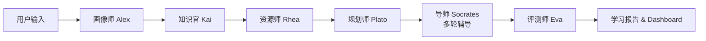

# KnowSubtle Learning Universe

> 基于 MetaGPT 的个性化资源生成与学习多智能体系统

## 概述

本项目基于 MetaGPT 框架，构建了一个由 **6 个专业 Agent** 组成的多智能体学习辅助系统 + **FastAPI 后端** + **Web 前端仪表板**。每个 Agent 拥有独立的角色、知识和行为模式，协同完成从学习者画像到学习辅导的全流程。

## 系统架构

### 六 Agent 流水线



### Agent 角色

| Agent | 名称 | 职责 |
|-------|------|------|
| **画像师** | Alex | 分析学习者的背景、目标、风格偏好，输出结构化的学习者画像 |
| **知识官** | Kai | 管理知识图谱，进行知识诊断，识别学习者的强项与薄弱点 |
| **资源师** | Rhea | 根据画像和诊断，生成个性化学习资源（文章、视频、习题） |
| **规划师** | Plato | 制定结构化学习路径，按优先级和依赖关系排布学习节点 |
| **导师** | Socrates | 苏格拉底式对话引导，通过提问激发思考，而非直接给答案 |
| **评测师** | Eva | 批改练习答案，提供细粒度评分和改进建议 |

### 数据流

```
用户 → [LearningGoal]
  → [LearnerProfile] (Alex)
  → [KnowledgeDiagnosis] (Kai)
  → [ResourcePlan] (Rhea)
  → [LearningPath] (Plato)
  → [TutorSession] (Socrates) × N
  → [ExerciseResult] (Eva)
  → 最终学习报告 & Dashboard 可视化
```

## 项目结构

```
learning-agent-system/
├── app.py                        # FastAPI 后端（所有 API 端点）
├── run_backend.py                # 后端启动引导脚本
├── pyproject.toml                # 项目配置与依赖
├── README.md                     # 本文件
├── test_integration.py           # 集成测试脚本
├── dashboard/                    # 前端仪表板
│   └── index.html                # KnowSubtle 学习宇宙控制台（单 HTML 文件）
├── learning_agent_system/        # 主包
│   ├── __init__.py
│   ├── main.py                   # CLI 入口
│   ├── orchestrator.py           # TeamOrchestrator（流水线调度）
│   ├── schema.py                 # 数据模型定义（16+ 模型）
│   ├── agents/                   # 6 个 Agent
│   │   ├── learner_profiler.py   # Agent: 画像师 Alex
│   │   ├── resource_generator.py # Agent: 资源师 Rhea
│   │   ├── learning_planner.py   # Agent: 规划师 Plato
│   │   ├── exercise_evaluator.py # Agent: 评测师 Eva
│   │   ├── learning_tutor.py     # Agent: 导师 Socrates
│   │   └── knowledge_base.py     # Agent: 知识官 Kai
│   ├── actions/                  # 12 个 Action 类
│   │   ├── pref_modeling.py      # 偏好建模
│   │   ├── knowledge_diagnosis.py# 知识诊断
│   │   ├── knowledge_ops.py      # 知识库操作
│   │   ├── knowledge_graph_generator.py # 知识图谱生成
│   │   ├── resource_generation.py# 资源生成
│   │   ├── learning_path.py      # 路径规划
│   │   ├── tutor_actions.py      # 辅导互动
│   │   ├── exercise_evaluation.py# 练习评测
│   │   ├── mistake_analyzer.py   # 错题分析
│   │   ├── achievement_checker.py# 成就检测
│   ├── memory/
│   │   ├── longterm_memory.py    # 文件持久化长期记忆
│   │   └── role_zero_memory.py   # RoleZero 记忆基类
│   ├── configs/
│   │   └── system_config.py      # 系统配置
│   └── tools/
│       └── tool_factory.py       # 工具工厂
```

## 快速开始

### 环境要求

- **Python**: 3.10 / 3.11 / 3.13
- **Node**: 仅用于前端开发（非必需）

### 安装

```bash
# 克隆仓库后
cd learning-agent-system

# 创建虚拟环境
python -m venv .venv
# Windows: .venv\Scripts\activate
# Linux/Mac: source .venv/bin/activate

# 安装依赖
pip install fastapi uvicorn pydantic httpx pyyaml aiosqlite sqlalchemy
pip install pywebview bottle  # 桌面窗口（可选）
```

> 项目使用 `local_metagpt` 作为 MetaGPT 的轻量打桩，运行打包版**无需**安装真实 MetaGPT。

### 启动（DEMO 模式，无需 API Key）

```bash
# 源码开发模式
METAGPT_STUBBED=1 python app.py
# 浏览器打开 http://127.0.0.1:8000
```

DEMO 模式由 `local_metagpt` 桩驱动，6 智能体流水线走离线占位逻辑，端到端可演示但**不含真实 AI 推理**。**导师对话**支持真实大模型，配置方式见下文。

### 配置导师对话的真实大模型

桌面端设置页或后端 POST 接口：

```bash
# 通过 API 配置（Key 仅存服务端，不落浏览器）
curl -X POST http://127.0.0.1:8000/api/config/llm \
  -H "Content-Type: application/json" \
  -d '{"base_url":"https://api.openai.com/v1","api_key":"sk-your-key","model":"gpt-4o-mini"}'
```

配置写入 `Config/llm_config.yaml`，**API Key 仅存于服务端磁盘**。前端 `GET /api/config/llm` 仅返回 `{configured, base_url, model}`，不含 `api_key`。未配置时 `POST /api/chat/agent` 返回 400 守卫。

### 运行

**方式一：CLI 模式**
```bash
# 学习 Python
python -m learning_agent_system.main --goal "我是一个零基础的初学者，想学习 Python 编程"

# 查看会话状态
python -m learning_agent_system.main --resume <session_id> --status
```

**方式二：Web 仪表板**
```bash
python app.py
# 浏览器访问 http://localhost:8000
```

## API 端点

| 端点 | 方法 | 说明 |
|------|------|------|
| `/api/health` | GET | 健康检查 |
| `/api/planets` | GET | 获取所有学习星球 |
| `/api/progress/{planet_id}` | GET | 获取学习进度 |
| `/api/tasks/{planet_id}` | GET | 获取今日任务 |
| `/api/tasks/{planet_id}/{task_id}/toggle` | POST | 切换任务完成状态 |
| `/api/achievements/{planet_id}` | GET | 获取成就列表 |
| `/api/mistakes/{planet_id}` | GET | 获取错题记录 |
| `/api/knowledge-graph/{planet_id}` | GET | 获取知识图谱数据 |
| `/api/memory-curve` | GET | 获取艾宾浩斯记忆曲线 |
| `/api/suggestions/{planet_id}` | GET | 获取 AI 学习建议 |
| `/api/tutor/chat` | POST | AI 导师对话 |
| `/api/chat/agent` | POST | 多智能体聊天（服务端代理，未配置 LLM 时返回 400） |
| `/api/config/llm` | GET/POST | LLM 配置管理（GET 不返回 api_key） |
| `/api/report-card` | GET | 获取学习报告卡 |
| `/api/sessions` | GET/POST | 学习会话管理 |
| `/api/session/status` | GET | 获取当前会话状态 |
| `/api/exercises` | GET/POST | 练习管理 |

## 前端仪表板

位于 `dashboard/index.html`，通过 FastAPI 静态文件服务提供访问。

核心功能：
- **学习星球选择**：四级/六级/考研/医学英语
- **进度追踪**：今日目标、周目标、连续天数
- **今日任务**：可切换的任务清单
- **成就系统**：成就徽章展示
- **错题分析**：错题记录与统计
- **知识图谱可视化**：SVG 交互式知识图谱
- **记忆曲线图表**：Canvas 艾宾浩斯记忆曲线
- **AI 导师对话**：与 Socrates 导师实时对话
- **AI 学习建议**：智能推荐与建议

### 启动方式

```bash
python app.py
# 浏览器访问 http://localhost:8000
```

### 交互功能

- 点击星球切换学习内容
- 点击任务前的复选框切换完成状态
- 在聊天输入框与 AI 导师对话
- 点击"开始学习"创建新的学习会话

## 编程接口

```python
import asyncio
from learning_agent_system.orchestrator import TeamOrchestrator

async def main():
    orchestrator = TeamOrchestrator(storage_dir=".my_memory")

    # 执行完整流水线
    ctx = await orchestrator.run_full_pipeline("学习 Python 装饰器")

    # 查看结果
    print(f"学习者画像: {ctx.learner_profile}")
    print(f"学习路径: {ctx.learning_path}")

    # 多轮辅导对话
    sessions = await orchestrator.run_tutor_loop(rounds=3)

    # 评测答案
    result = await orchestrator.run_evaluation("这是我的答案...")
    print(f"评分: {result.score}/100")

asyncio.run(main())
```

## 配置

系统配置在 `learning_agent_system/configs/system_config.py` 中管理，支持：
- **LLM 后端**: 通过 `POST /api/config/llm` 配置（持久化到 `Config/llm_config.yaml`），Key 仅存服务端
- **知识库路径**: 自定义知识库文件路径
- **Agent 参数**: 各 Agent 的温度、最大 token 等
- **存储路径**: 记忆和检查点的存储目录

数据目录默认位于 `%APPDATA%/KnowSubtle/Data`，可用 `LAS_DATA_DIR`/`LAS_DB_PATH` 环境变量重定向。

## 开发里程碑

| 阶段 | 完成状态 |
|------|----------|
| Agent 核心实现（6 Agents + 12 Actions） | ✅ |
| TeamOrchestrator 流水线编排 | ✅ |
| FastAPI 后端与全部 API 端点 | ✅ |
| 前端 Dashboard（知识图谱/记忆曲线/成就等） | ✅ |
| 前后端 API 完整对接 | ✅ |
| 端到端集成测试 | ✅ |
| 项目文档 | ✅ |
| 前后端安全审计与修复 | ✅ |

## 安全

| 项 | 描述 | 状态 |
|----|------|------|
| CORS | 移除 `"null"` origin，限制可信来源 | ✅ S1 |
| Session ID | 使用 `secrets.token_hex(16)` 随机化，不可预测 | ✅ S2 |
| 存储 XSS | profile.html bio→toast 使用 `escHtml()` 转义 | ✅ S3 |
| API Key 隔离 | LLM 配置 Key 仅存服务端 `Config/llm_config.yaml`，`GET /api/config/llm` 绝不回传 | ✅ Phase 1 |

## 许可证

MIT License